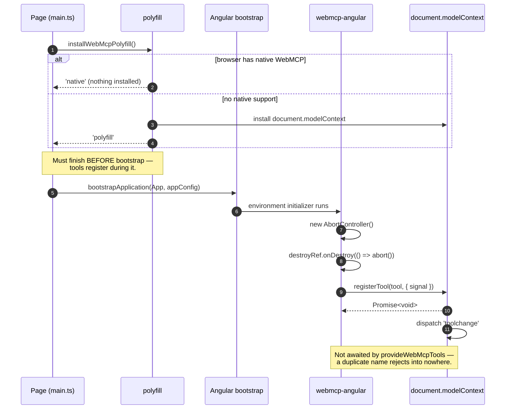
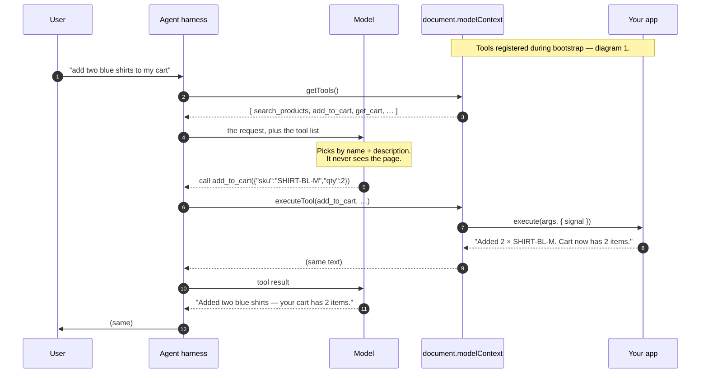
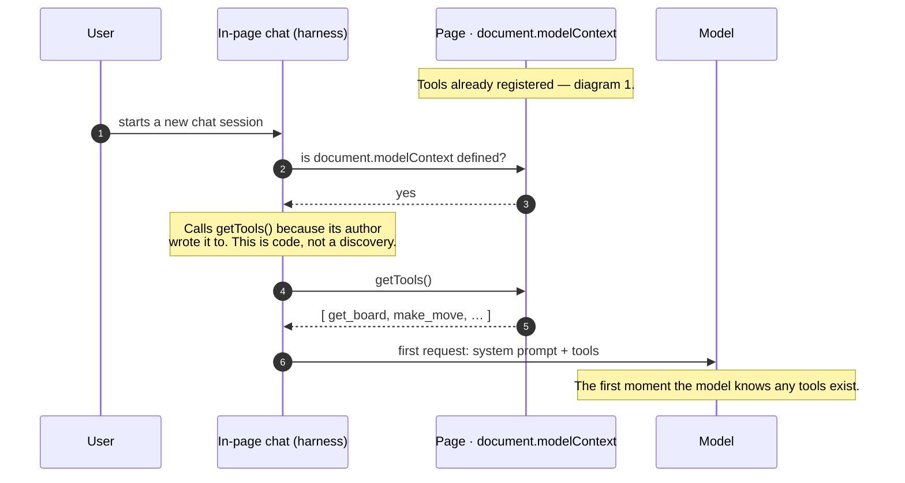
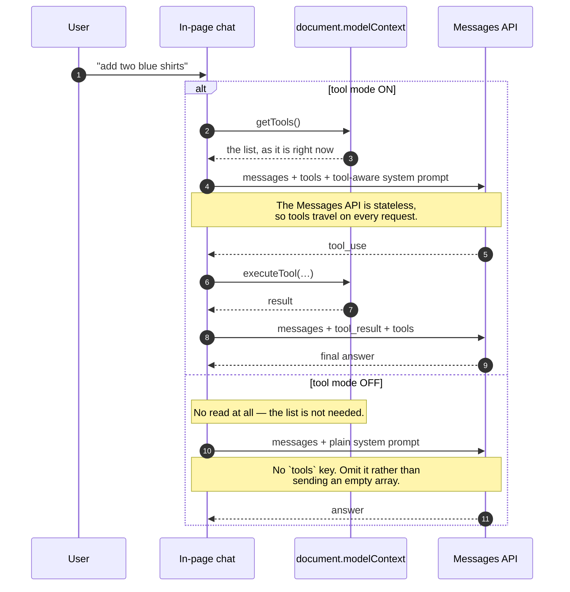
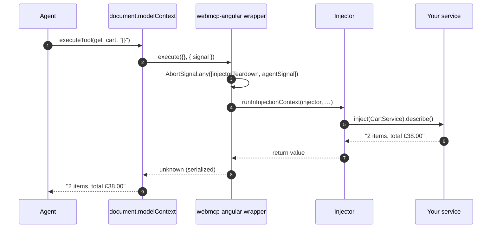
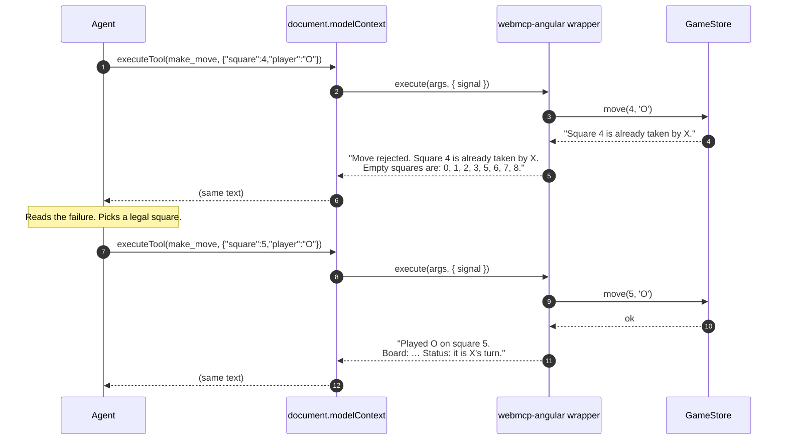
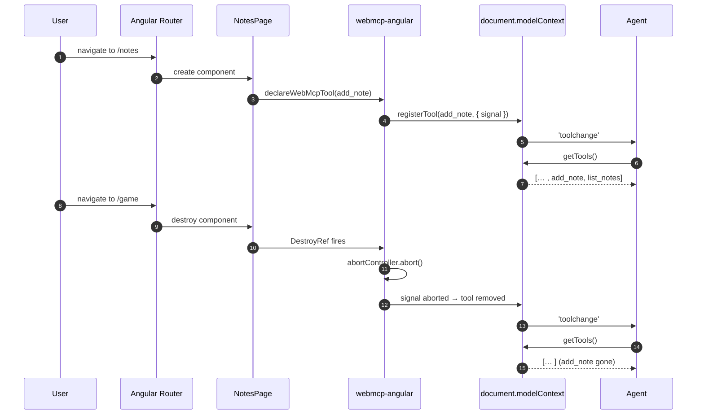
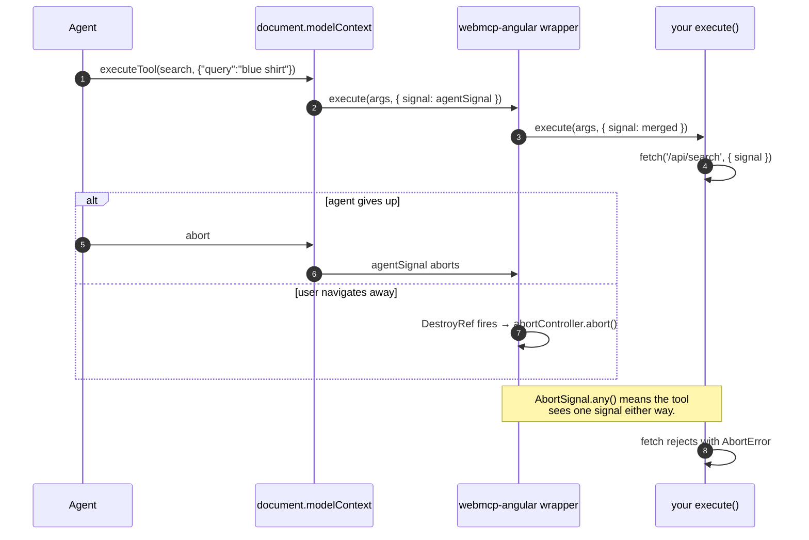
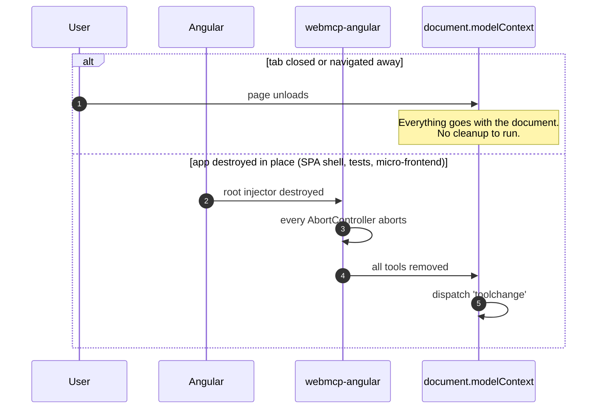
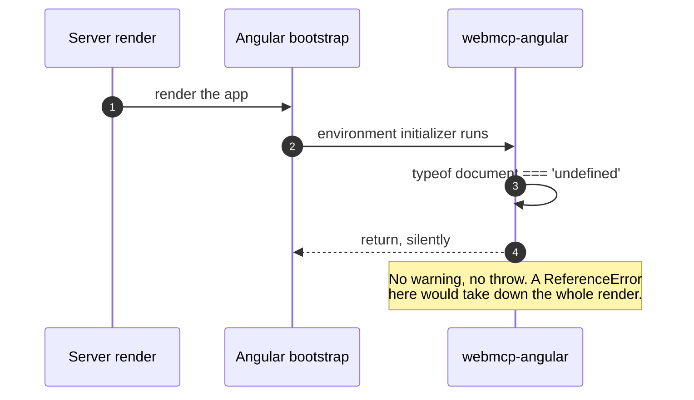

[← what bites you](./06-what-bites-you.md) · [contents](./README.md) · next: [The full sequence: external agent →](./08-lifecycle-external-agent.md)

# 7. The full sequence: in-page agent

Every exchange between your app, the browser, and an agent **you wrote into the
page** — a chat panel that calls the LLM itself — from page load to tab close. Each
diagram gets a few lines and a link to the chapter that explains it.

An agent that reaches in from *outside* the page — an extension, Claude Desktop — is
[chapter 8](./08-lifecycle-external-agent.md). Diagrams 3–8 here are shared: once a
call is inside the page, nothing differs.

| Lane | Is |
|---|---|
| **Agent** | your chat: a *harness* (code) plus a *model* (the LLM); diagram 2 splits them |
| **modelContext** | `document.modelContext` — native or polyfill |
| **webmcp-angular** | `declareWebMcpTool` / `provideWebMcpTools` and the adapter |
| **Injector** | the Angular injector that owns a tool's lifetime |
| **Your service** | `CartService`, `GameStore` — knows nothing about WebMCP |

---

## 1. Page load and registration

Polyfill first, then bootstrap. Flip the order and step 12 never happens: the adapter
finds no `document.modelContext`, returns silently, and you get a working app with no
tools ([chapter 5](./05-transports.md#layer-2-the-polyfill)).

## 2. A user asks the agent to do something

Only the harness touches the page (steps 2 and 6). The model is handed the list (4)
and answers with a name and arguments (5), chosen from `name` and `description` alone
([chapter 1](./01-what-webmcp-is.md#who-calls-which)). Step 2 happens because of
step 1. Steps 6–9 are diagram 3.

### How each agent reached the page

| Agent | Got to the page by | Calls `getTools()` because |
|---|---|---|
| **Browser's own** | the user opened the page; the browser takes an *observation* of the tab | it owns the registry |
| **In-page chat** | you wrote it into the page | you wrote that line |
| **Extension / MCP client** | the user installed it once; the browser injects its script; it probes over `postMessage` | its author wrote the probe — [chapter 8](./08-lifecycle-external-agent.md) is that arc |

### Session start

A new session is an empty history, so this runs from the top each time. What the app
is *as a whole* rides as a tool of its own (`about_this_app`), read once per session
into the system prompt ([chapter 3](./03-anatomy-of-a-call.md#writing-a-good-tool)).

### Cadence, when you control the agent

Once per user turn — the list is live (diagram 5) — and not again between the calls
within a turn. In the playground the read is wrapped as `discoverTools()`.

| The toggle moves | The toggle leaves alone |
|---|---|
| the `tools` key **and** the system prompt — swap both, or the model narrates calls it never made | registration: tools stay on `document.modelContext` for the inspector, the browser's agent, and any MCP client |
| mid-conversation: start a new session, or keep sending `tools` with `tool_choice: {type: 'none'}` once the history holds tool blocks | |

## 3. Inside a tool call

Step 3 merges the two cancellations into one signal; step 4 is why `inject()` works
inside `execute` ([chapter 2](./02-the-lifecycle.md#the-real-implementation)).

## 4. A mutating call that gets rejected, then retried

The rejection text is the control flow: step 5 names the legal alternatives, so step 7
is right first time. Step 11 returns the new state and saves a `get_board` round trip
([chapter 3](./03-anatomy-of-a-call.md#writing-a-good-tool)).

## 5. Navigating: tools appear and disappear

Aborting the signal *is* unregistration ([chapter 2](./02-the-lifecycle.md)). A
long-lived consumer refetches on `toolchange`, which fires at the ModelContext
([chapter 6 §7](./06-what-bites-you.md)). Route-level `providers` skip steps 9–12 on
Angular 20/21 ([chapter 4](./04-scope-and-navigation.md#the-trap-route-level-providers)).

## 6. Cancellation, from either end

Pass `client.signal` into anything that hits the network and both directions cancel
correctly for free.

## 7. Teardown

The second branch is what the [test harness](../guide/04-testing.md) asserts on.

## 8. And on the server, nothing happens

Then the client hydrates and diagram 1 runs for real.

---

next: [The full sequence: external agent →](./08-lifecycle-external-agent.md)

[← back to contents](./README.md)
