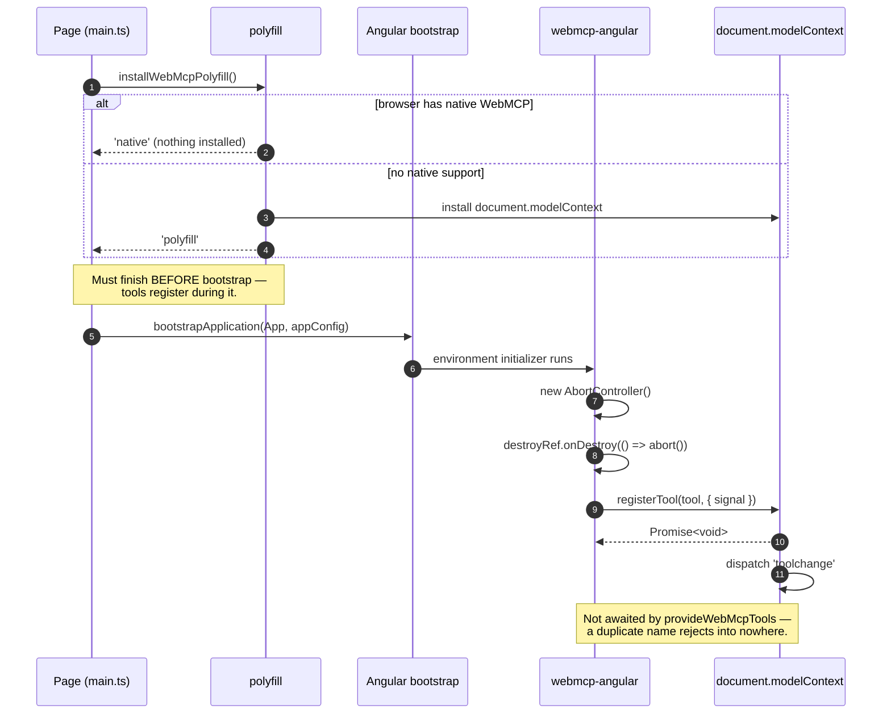
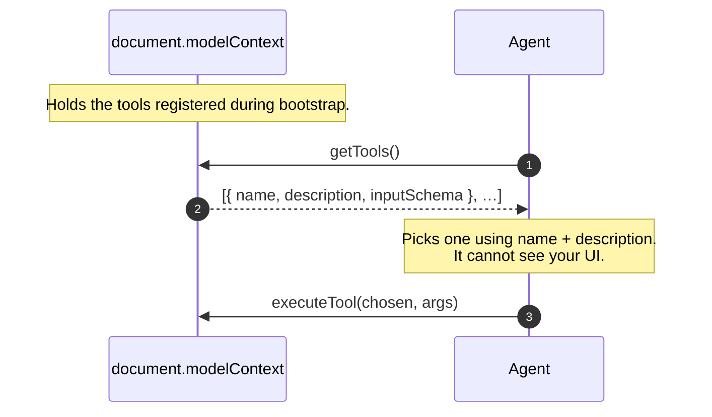
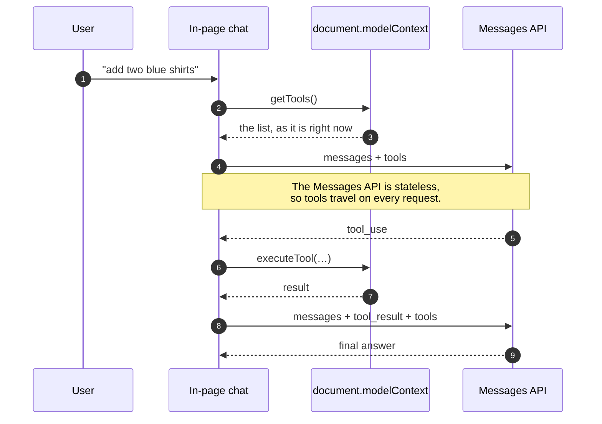
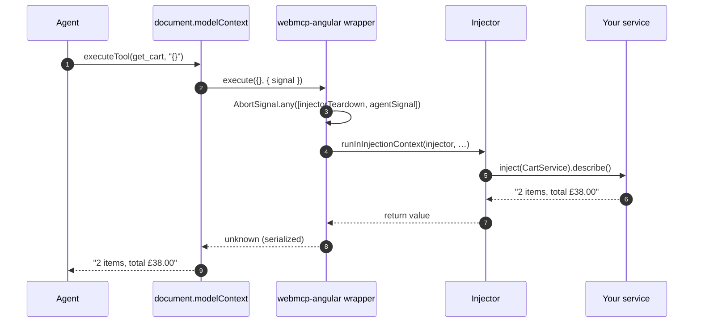
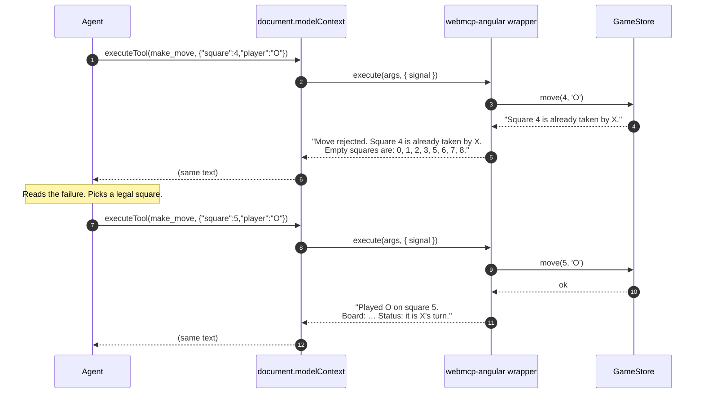
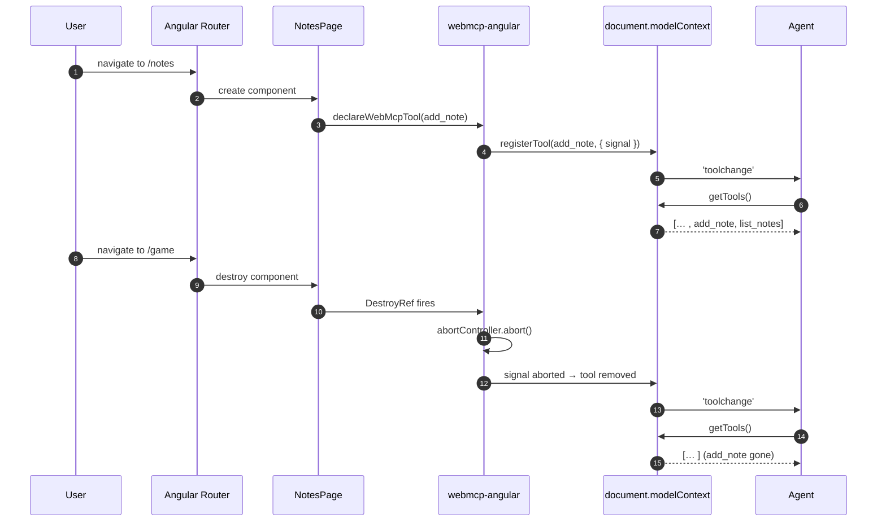
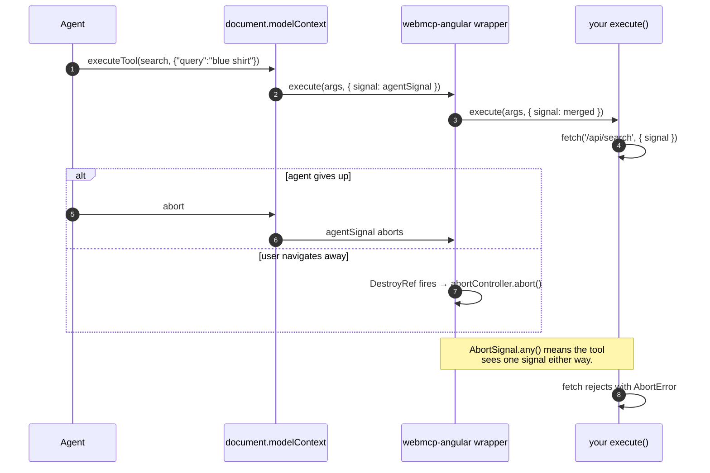
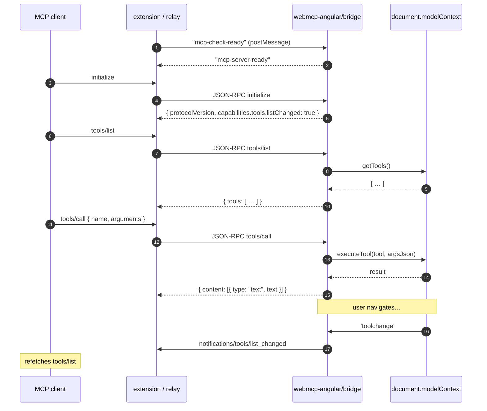
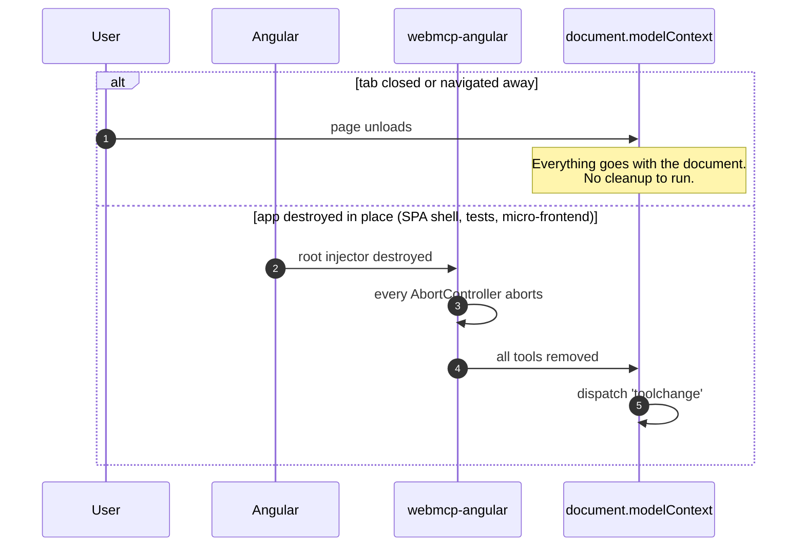
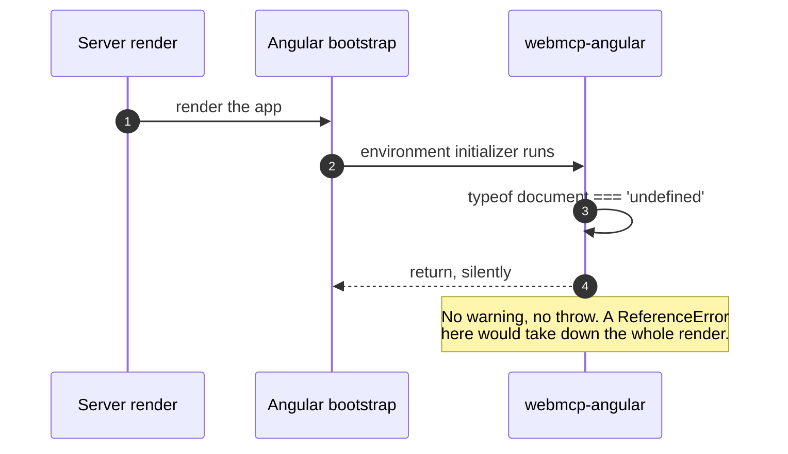

[← what bites you](./06-what-bites-you.md) · [contents](./README.md)

# 7. The full sequence

Every exchange between your app, the browser, and an agent — from the page loading to
the tab closing.

The earlier chapters explain each mechanism in isolation. This one puts them on one
timeline, which is usually what you need when something happens in the wrong order.

**Participants**, consistent across every diagram below:

| | |
|---|---|
| **Agent** | whatever is calling your tools: the browser's own agent, an in-page chat, or an external MCP client ([diagram 2](#2-how-an-agent-discovers-the-tools)) |
| **modelContext** | `document.modelContext` — native or polyfill |
| **webmcp-angular** | `declareWebMcpTool` / `provideWebMcpTools` and the adapter |
| **Injector** | the Angular injector that owns a tool's lifetime |
| **Your service** | `CartService`, `GameStore` — knows nothing about WebMCP |

---

## 1. Page load and registration



**If the polyfill loses this race**, `registerTool` is never reached: the adapter
finds no `document.modelContext`, returns early, and says nothing. You get a working
app with no tools and no error. That is the single most common setup mistake.

## 2. How an agent discovers the tools

Registration (diagram 1) puts your tools on `document.modelContext`. An agent reads
them from there.



Everything the agent knows about your app is the text you wrote, which is why
[descriptions matter](../guide/02-writing-tools.md#write-descriptions-for-someone-who-cant-see-your-ui).

### When the read happens

Three kinds of agent sit in that lane, and they read at different moments:

| | Where it runs | When it calls `getTools()` |
|---|---|---|
| **The browser's built-in agent** | outside the page | on its own schedule — typically when the user asks it to do something |
| **In-page code** — a chat panel, the inspector | in your page | when you call it; once per user turn is the right cadence |
| **An external MCP client** — Claude Desktop, Cursor | another process | on `tools/list` through [the bridge](#7-reaching-an-agent-outside-the-page), then again on `notifications/tools/list_changed` |

Your code is not notified when a read happens. The first thing your app observes is a
tool actually executing — diagram 3.

### An in-page chat, turn by turn

This is the case you control, so it is worth seeing in full:



Fetch **once per user turn**: the list is live, and the user may have navigated since
the last message and gained or lost tools (diagram 5). Fetching again between the
tool calls *within* a turn is waste — it cannot change mid-turn.

### Keeping a long-lived consumer current

A consumer that holds the list — a panel, a connected MCP client — listens for
`toolchange` and refetches:

```ts
const refresh = () => { /* getTools() again */ };

document.addEventListener('toolchange', refresh);
document.modelContext?.addEventListener?.('toolchange', refresh);   // ← both
```

Listen on both targets. The spec dispatches on the document; the polyfill dispatches
only on the ModelContext ([chapter 6 §8](./06-what-bites-you.md)).

## 3. A read-only call



Two things happen in the wrapper that make the whole integration work:
`runInInjectionContext` is why `inject()` works inside `execute`, and
`AbortSignal.any` merges the agent's cancellation with the injector's teardown so
your tool only has to watch one signal.

## 4. A mutating call that gets rejected, then retried

This is the loop that makes agents useful, and it only works if you
[return failures as text](../guide/02-writing-tools.md#validate-everything).



Had the tool **thrown** instead, the turn would have ended there. The rejection text
is the control flow — and naming the legal alternatives is what turns one retry into
a correct one.

Note the success reply carries the **new board state**. That saves the agent a
follow-up `get_board`: one fewer round trip, real latency and tokens.

## 5. Navigating: tools appear and disappear



There is no `unregisterTool` in the spec. **Aborting the signal *is* unregistration**
— see [chapter 2](./02-the-lifecycle.md).

Two traps on this path:

- Register through a route's `providers` array instead of the component, and the
  removal half never happens on Angular 20 or 21 — the route injector is not
  destroyed ([chapter 4](./04-scope-and-navigation.md)).
- Listen for `toolchange` on the document alone and you will never hear it on a
  polyfilled page; the polyfill dispatches only on the ModelContext
  ([chapter 6 §8](./06-what-bites-you.md)).

## 6. Cancellation, from either end



Pass `client.signal` into anything that hits the network and you get correct
cancellation from both directions for free.

## 7. Reaching an agent outside the page

Everything above assumes an agent inside the browser. WebMCP has no wire format, so
an external MCP client — Claude Desktop, Cursor — needs
[the bridge](../guide/05-inspecting-and-connecting.md#the-bridge).



`listChanged` is not a courtesy. Diagram 5 shows the tool list genuinely changing
under the client's feet, so one that caches without listening will call tools that no
longer exist.

## 8. Teardown



The second branch is the one that matters in tests and micro-frontends: destroying
the injector really does remove the tools, which is why the
[test harness](../guide/04-testing.md) can assert on it.

## 9. And on the server, nothing happens



Then the client hydrates and diagram 1 runs for real.

---

[← back to contents](./README.md)
