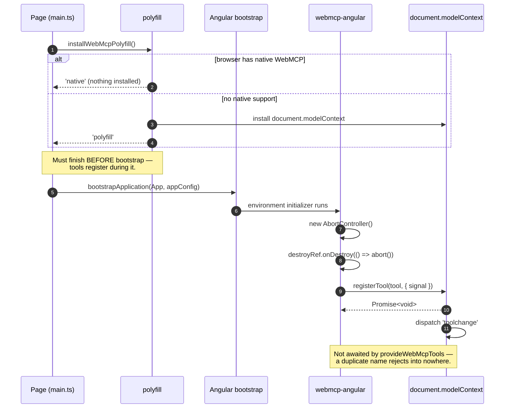
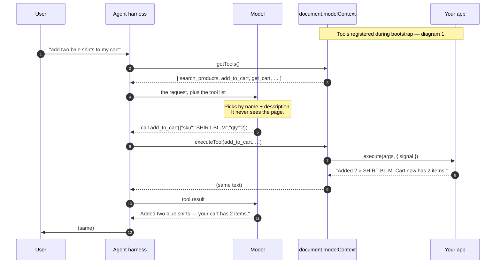
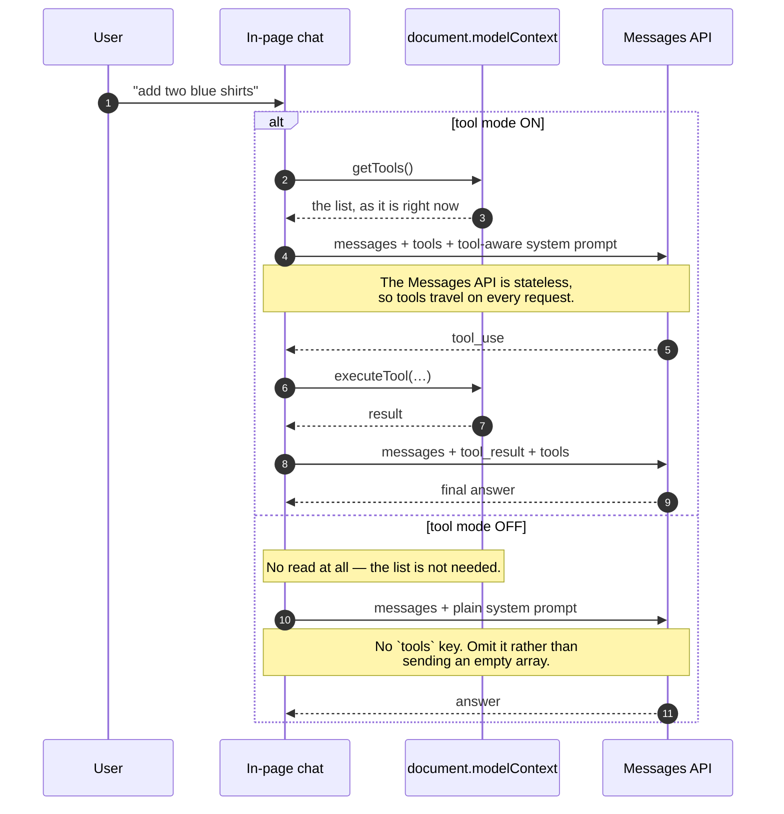
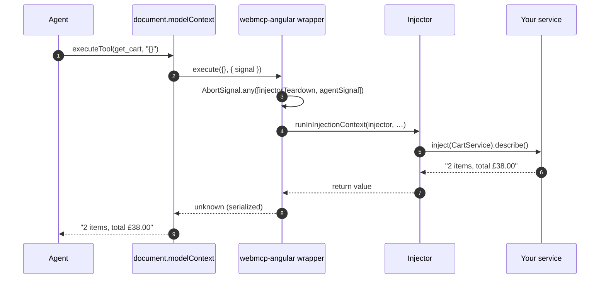
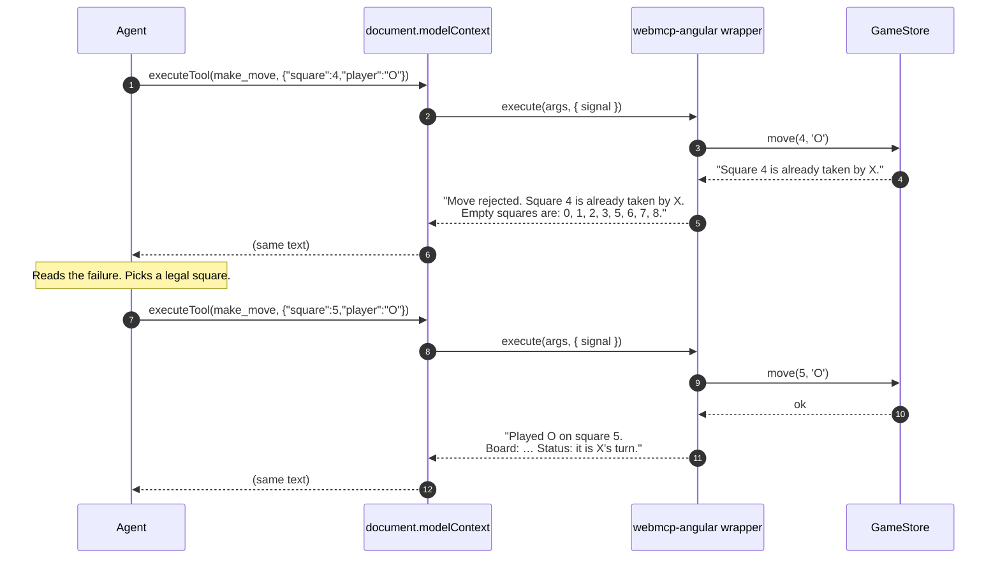
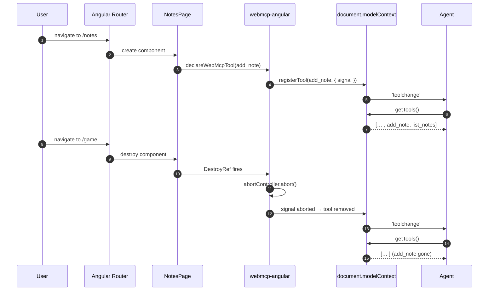
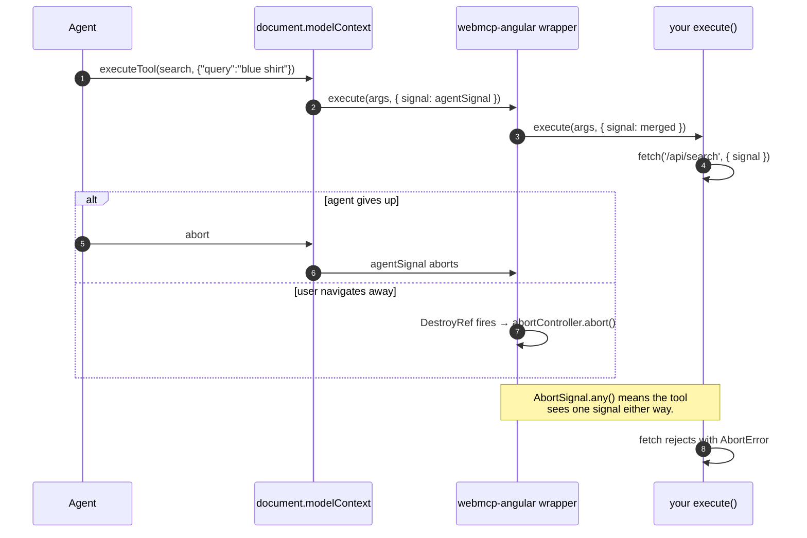
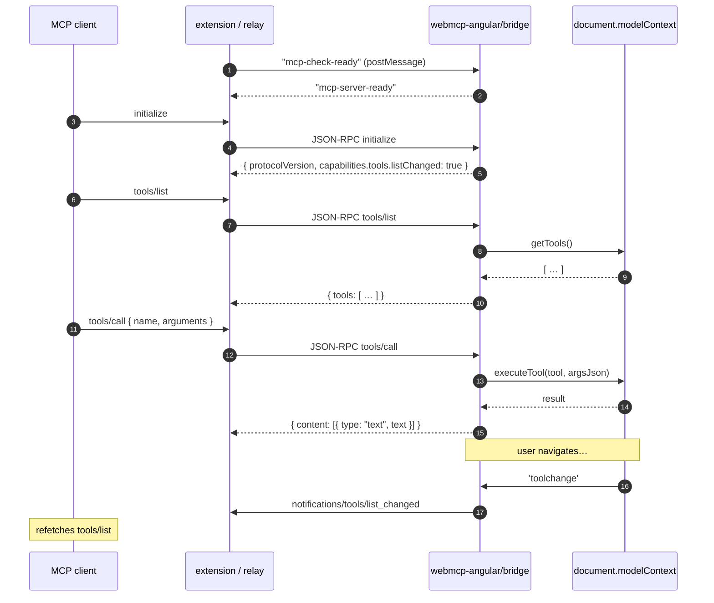
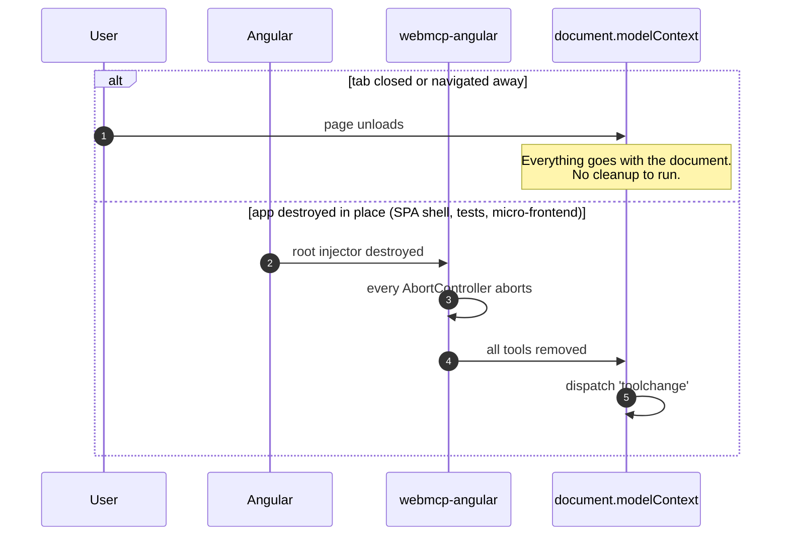
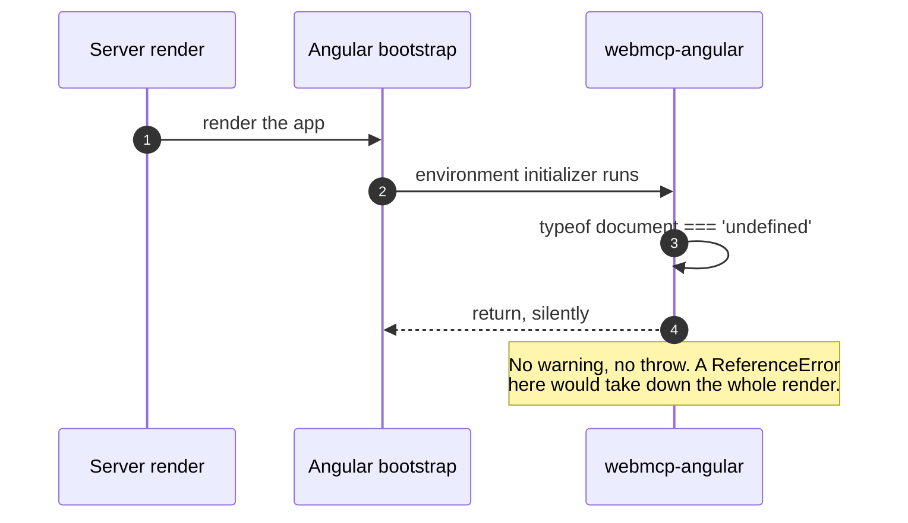

[← what bites you](./06-what-bites-you.md) · [contents](./README.md)

# 7. The full sequence

Every exchange between your app, the browser, and an agent — from the page loading to
the tab closing.

The earlier chapters explain each mechanism in isolation. This one puts them on one
timeline, which is usually what you need when something happens in the wrong order.

**Participants**, consistent across every diagram below:

| | |
|---|---|
| **Agent** | whatever is calling your tools: the browser's own agent, an in-page chat, or an external MCP client. Really a *harness* plus a *model* — only the harness touches the page, and [diagram 2](#2-a-user-asks-the-agent-to-do-something) splits them |
| **modelContext** | `document.modelContext` — native or polyfill |
| **webmcp-angular** | `declareWebMcpTool` / `provideWebMcpTools` and the adapter |
| **Injector** | the Angular injector that owns a tool's lifetime |
| **Your service** | `CartService`, `GameStore` — knows nothing about WebMCP |

---

## 1. Page load and registration



**If the polyfill loses this race**, `registerTool` is never reached: the adapter
finds no `document.modelContext`, returns early, and says nothing. You get a working
app with no tools and no error. That is the single most common setup mistake.

## 2. A user asks the agent to do something

`getTools()` is not something an agent does on a timer. It reads the list because a
**user asked it for something** and it needs to know what this page can do.

Here is the whole arc, end to end:



### The two halves of an "agent"

Elsewhere in this chapter *Agent* is one lane. Here it is split, because this is
exactly where the confusion lives:

- **The harness** is ordinary code — a browser feature, your chat component, an MCP
  client. It is the only half that touches `document.modelContext`: it calls
  `getTools()` (step 2) and `executeTool()` (step 6).
- **The model** never sees the page and never calls anything. It is *handed* the tool
  list (step 4) and replies with a name and arguments (step 5). Tool-calling is a
  feature of the model API, not of WebMCP.

So "how does the model know to call `getTools()`?" has no answer — it never does. The
harness reads the list and passes it in.

Step 2 happens **because of step 1**, a user asking for something, not on a schedule.

Everything the model knows about your app is the text you wrote — step 5 is a choice
made purely from `name` and `description`, which is why
[descriptions matter](../guide/02-writing-tools.md#write-descriptions-for-someone-who-cant-see-your-ui).

Steps 6–9 are the tool call itself. [Diagram 3](#3-inside-a-tool-call) zooms into them.

### How the agent got here — and where the design gap is

Step 2 assumes the harness is already attached to the page. The spec does not say how
that happens. It describes registration and discovery, then: *"an agent connected to
the page queries the browser to discover the active list of tools."* How it came to be
connected is out of scope.

For one of the three agents that is fine. For the other two it is a real gap.

**The browser's built-in agent — no gap.** `registerTool()` writes into an object the
browser owns, so it sees your tools the moment you register them, and `toolchange`
when they change. Navigation *is* the configuration step: the user opening the page is
what "adds the server". Nothing to discover.

**In-page code — no gap, trivially.** A chat panel or the inspector feature-detects
`document.modelContext` (that is all `isWebMcpSupported()` does). You wrote both ends,
so there is no discovery problem.

**An external agent — Claude Desktop, Cursor, any extension — three things it cannot
do.**

1. **Find the page.** There is no meta tag, HTTP header, manifest or well-known URL a
   page can publish to say "I have tools." An agent outside the page has no way to
   know it is worth entering without first executing code inside it.

   MCP has the same runtime hole, but an out-of-band answer — host configuration and
   the registry ([chapter 8](./08-will-this-be-standardised.md)). WebMCP's only
   out-of-band answer is navigation, which exists for the browser alone.

2. **Know it is welcome.** Once inside, finding `document.modelContext` proves
   nothing about intent. `exposedTo` on `registerTool()` scopes by *origin* — it is
   for cross-origin documents, not for kinds of agent. And with the polyfill
   installed, `document.modelContext` exists on every page that included it.

   This one is unresolvable in the current design, on purpose: the spec declines to
   let a page distinguish agents (WebKit's objection is that it should not be able
   to), and the corollary is that a page cannot scope tools to a class of agent
   either.

3. **Hear an announcement.** A page can only `postMessage` into its own window. Our
   bridge broadcasts `mcp-server-ready` once at `start()` and answers
   `mcp-check-ready` whenever one arrives — so a client that attaches late is fine,
   *if* it already knows to probe on that channel. Which is problem 1 again.

**What actually happens today:** the user installs a specific extension; it injects a
content script into pages, probes for `document.modelContext`, and shakes hands on the
channel `@mcp-b/transports` defines ([diagram 7](#7-reaching-an-agent-outside-the-page)).
None of that is in the WebMCP spec. It is a workaround the ecosystem built around the
gap, not a design.

**What this means for you.** If you only *expose* tools, nothing — register them and
whoever is looking will find them. If you are building an external agent, budget for
the extension and the probe; there is no lighter path. And do not add a page-side
beacon expecting anyone to hear it: it helps only if agents agree to listen, and no
agreement exists.

### The same arc, for the three kinds of agent

Who plays the *Agent* lane changes where the trigger comes from, but not the shape:

| | Trigger for `getTools()` | Notes |
|---|---|---|
| **The browser's built-in agent** | the user asks it something, in the browser's own UI | you never see the read; the first thing your app observes is step 7 |
| **In-page code** — a chat panel, the inspector | the user sends a message, or opens the panel | you write this, so you choose the moment |
| **An external MCP client** — Claude Desktop, Cursor | the client's own `tools/list`, through [the bridge](#7-reaching-an-agent-outside-the-page) | refreshed when you push `notifications/tools/list_changed` |

### Cadence, when you control the agent

An in-page chat is the case you write yourself, so the cadence is your decision.
**Once per user turn** is the right one — and a chat with a tools on/off toggle skips
the read entirely when it is off:



Per turn, because the list is live: the user may have navigated since their last
message and gained or lost tools (diagram 5). Not again between the tool calls
*within* a turn — it cannot change mid-turn, so that would be waste.

> In the `webmcp-angular-playground` sample app this read is wrapped in a helper
> called `discoverTools()`, which calls `getTools()` and maps the result into the
> Messages API's `tools` shape. These diagrams name the browser API; your own code
> will usually name its wrapper instead.

#### Two things move with the toggle, not one

The `tools` key is the obvious half. The **system prompt** is the half people forget:
leave a tool-aware prompt in place with tools switched off and the model offers to do
things it cannot, or narrates calls it never made. Swap both together.

What does *not* move is registration. Tools stay on `document.modelContext` either
way — the toggle governs what your chat sends, not what the page publishes. The
inspector, the browser's own agent and any connected MCP client keep seeing them. If
you truly want them gone for everyone, that is a different act: destroy the injectors
that own them (diagram 8).

#### Switching mid-conversation

Once a turn has run with tools on, the transcript holds `tool_use` and `tool_result`
blocks. Replaying that history with no `tools` defined leaves the model reading blocks
it has no schema for, so design the toggle so it cannot arise:

- **Toggle starts a new session** — new conversation, empty history. Simplest, and it
  matches how people think about a mode switch.
- **Or keep the conversation** and, when tools are off but the history already
  contains tool blocks, still send `tools` alongside `tool_choice: {type: 'none'}`.
  The model cannot call anything, and the transcript stays interpretable.

### Keeping a long-lived consumer current

Something that holds the list across turns — a panel, a connected MCP client —
listens for `toolchange` and refetches:

```ts
const refresh = () => { /* getTools() again */ };

document.addEventListener('toolchange', refresh);
document.modelContext?.addEventListener?.('toolchange', refresh);   // ← both
```

Listen on both targets. The spec dispatches on the document; the polyfill dispatches
only on the ModelContext ([chapter 6 §8](./06-what-bites-you.md)).

## 3. Inside a tool call

Steps 6–9 of diagram 2, with the machinery that sits between the browser and your
service.



Two things happen in the wrapper that make the whole integration work:
`runInInjectionContext` is why `inject()` works inside `execute`, and
`AbortSignal.any` merges the agent's cancellation with the injector's teardown so
your tool only has to watch one signal.

## 4. A mutating call that gets rejected, then retried

This is the loop that makes agents useful, and it only works if you
[return failures as text](../guide/02-writing-tools.md#validate-everything).



Had the tool **thrown** instead, the turn would have ended there. The rejection text
is the control flow — and naming the legal alternatives is what turns one retry into
a correct one.

Note the success reply carries the **new board state**. That saves the agent a
follow-up `get_board`: one fewer round trip, real latency and tokens.

## 5. Navigating: tools appear and disappear



There is no `unregisterTool` in the spec. **Aborting the signal *is* unregistration**
— see [chapter 2](./02-the-lifecycle.md).

Two traps on this path:

- Register through a route's `providers` array instead of the component, and the
  removal half never happens on Angular 20 or 21 — the route injector is not
  destroyed ([chapter 4](./04-scope-and-navigation.md)).
- Listen for `toolchange` on the document alone and you will never hear it on a
  polyfilled page; the polyfill dispatches only on the ModelContext
  ([chapter 6 §8](./06-what-bites-you.md)).

## 6. Cancellation, from either end



Pass `client.signal` into anything that hits the network and you get correct
cancellation from both directions for free.

## 7. Reaching an agent outside the page

Everything above assumes an agent inside the browser. WebMCP has no wire format, so
an external MCP client — Claude Desktop, Cursor — needs
[the bridge](../guide/05-inspecting-and-connecting.md#the-bridge).



`listChanged` is not a courtesy. Diagram 5 shows the tool list genuinely changing
under the client's feet, so one that caches without listening will call tools that no
longer exist.

## 8. Teardown



The second branch is the one that matters in tests and micro-frontends: destroying
the injector really does remove the tools, which is why the
[test harness](../guide/04-testing.md) can assert on it.

## 9. And on the server, nothing happens



Then the client hydrates and diagram 1 runs for real.

---

[← back to contents](./README.md)
