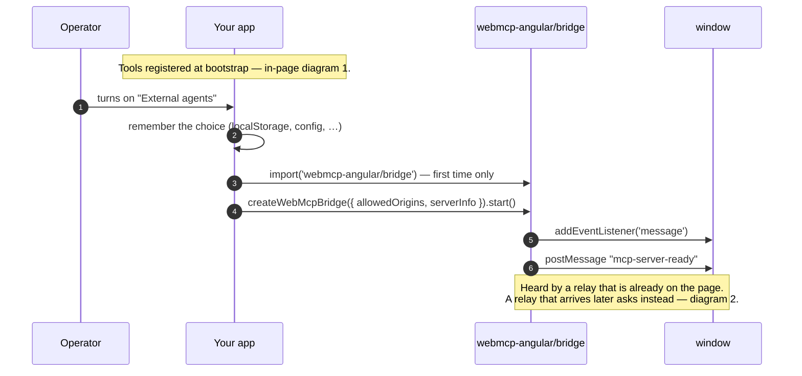
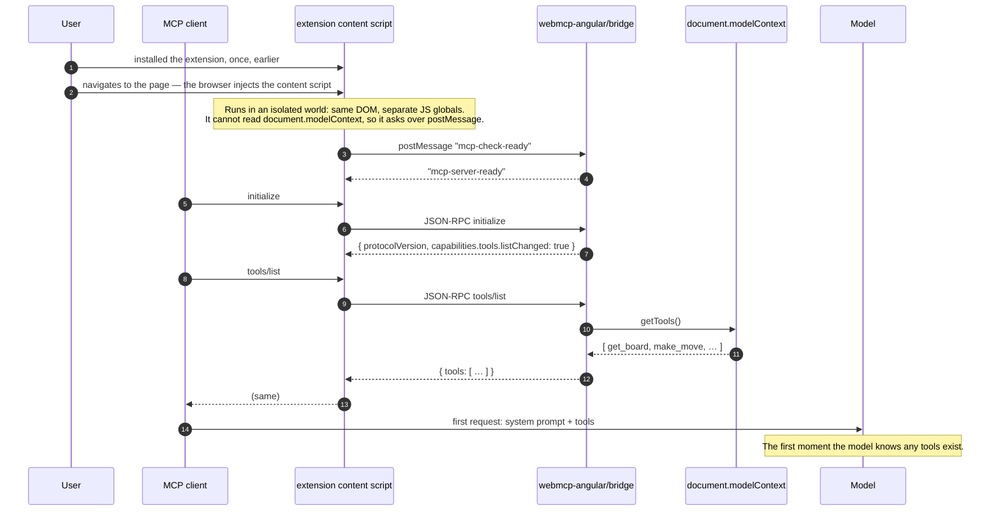
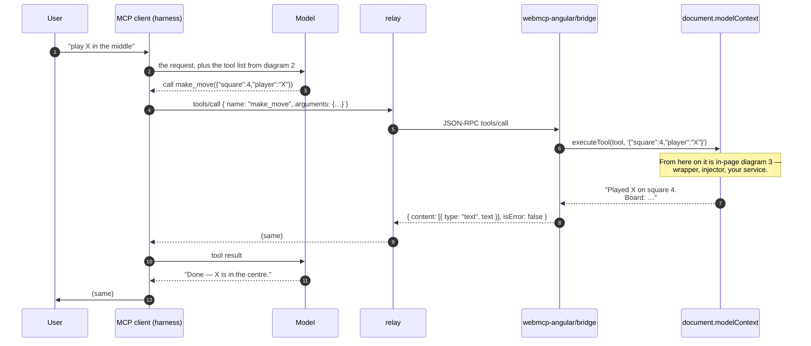
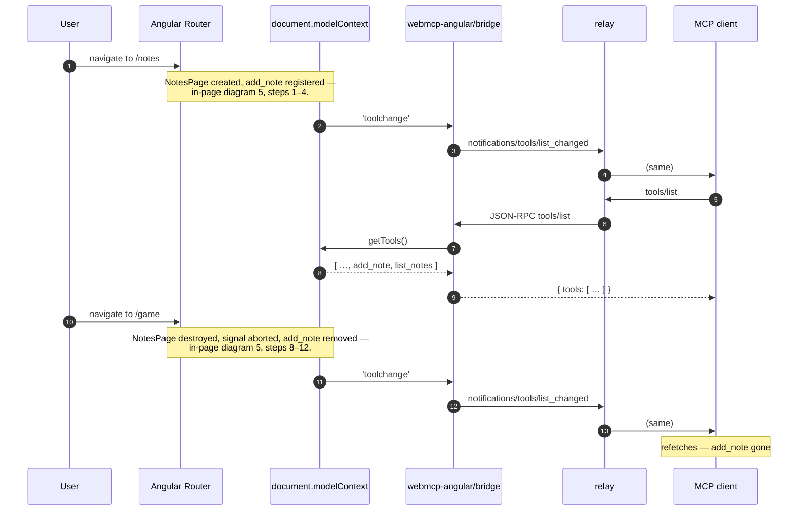
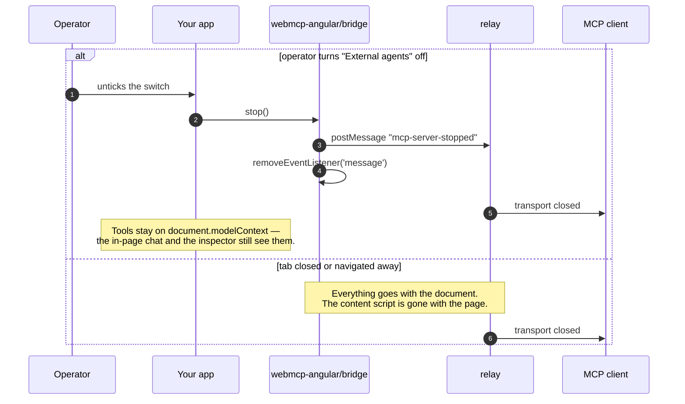

[← the in-page agent](./07-lifecycle-in-page-agent.md) · [contents](./README.md) · next: [Will this be standardised? →](./09-will-this-be-standardised.md)

# 8. The full sequence: external agent

Every exchange when the agent lives **outside the page** — an extension's content
script, Claude Desktop, Cursor — and reaches your tools through the bridge. It
differs from the [in-page arc](./07-lifecycle-in-page-agent.md) in how the agent
gets to the page, how a session starts, and how the door opens and closes. From the
moment a call reaches `document.modelContext`, nothing differs, and this chapter
points at the in-page diagrams for those steps rather than repeating them.

| Lane | Is |
|---|---|
| **Operator** | whoever runs the app and decides whether outside agents may connect |
| **Client** | the MCP client: Claude Desktop, Cursor — the harness, with a model behind it |
| **Relay** | what carries JSON-RPC into the page: an extension content script, or `@mcp-b/webmcp-local-relay` |
| **Bridge** | `webmcp-angular/bridge`, listening on the page's window for `postMessage` envelopes |
| **modelContext** | `document.modelContext` — native or polyfill |

---

## 1. The page opens the door

Tools register at page load exactly as in
[in-page diagram 1](./07-lifecycle-in-page-agent.md#1-page-load-and-registration).
The bridge is a separate act, and an opt-in one:

Off by default, loaded lazily, started only when someone asked
([guide chapter 6](../guide/06-external-agents.md#make-it-opt-in),
[decision 022](../decisions/022-bridge-opt-in.md)). Until step 4 runs, nothing outside
the page can see the tools, whatever `document.modelContext` holds.

## 2. The agent arrives and a session starts

Everything before step 4 is the user's doing and the browser's: the page had no way
to ask for any of it. There is no meta tag, header or manifest by which a page
announces tools; an outside agent finds them only by running code inside the page,
and the probe on step 4 is that code
([chapter 9 · the discovery gap](./09-will-this-be-standardised.md#the-discovery-gap)).

Steps 6–8 are MCP `2025-11-25`. MCP `2026-07-28` replaced `initialize` with a
stateless handshake and `server/discover`; the bridge does not answer that yet
([STATUS](../STATUS.md)).

## 3. A user asks the agent to do something

Same shape as [in-page diagram 2](./07-lifecycle-in-page-agent.md#2-a-user-asks-the-agent-to-do-something),
with two hops added between the harness and the page (steps 4–5 and 9–10). The tool
list was read once at session start, not per turn — which is why diagram 4 exists.

A rejected call comes back as a **successful** response with `isError: true` and the
tool's text in `content`, so the model reads the reason and retries — the loop in
[in-page diagram 4](./07-lifecycle-in-page-agent.md#4-a-mutating-call-that-gets-rejected-then-retried),
one envelope thicker.

## 4. Navigating: keeping the client current

The client holds its list across turns, so it must listen. The bridge hears
`toolchange` at the ModelContext ([chapter 6 §7](./06-what-bites-you.md)) and turns
it into `list_changed`; a client that caches without listening calls tools that no
longer exist. Under MCP `2026-07-28` the notification reaches only clients that
subscribed with `subscriptions/listen`.

## 5. The door closes

`stop()` is what makes the switch honest: a connected client is told, rather than
left posting into a window that no longer answers. Turning it back on runs diagram 1
again; a relay still on the page hears the new `mcp-server-ready`.

## Shared with the in-page arc

Inside the page, an external agent's call is indistinguishable from an in-page one.
These diagrams apply unchanged:

| In-page diagram | What it covers |
|---|---|
| [1 · Page load and registration](./07-lifecycle-in-page-agent.md#1-page-load-and-registration) | polyfill first, then bootstrap, then `registerTool` |
| [3 · Inside a tool call](./07-lifecycle-in-page-agent.md#3-inside-a-tool-call) | wrapper, `AbortSignal.any`, `runInInjectionContext`, your service |
| [4 · Rejected, then retried](./07-lifecycle-in-page-agent.md#4-a-mutating-call-that-gets-rejected-then-retried) | failure text as control flow |
| [6 · Cancellation](./07-lifecycle-in-page-agent.md#6-cancellation-from-either-end) | the caller's signal arrives through `tools/call`'s cancellation, the injector's through teardown |
| [7 · Teardown](./07-lifecycle-in-page-agent.md#7-teardown) | injector destroyed → every tool removed |
| [8 · The server](./07-lifecycle-in-page-agent.md#8-and-on-the-server-nothing-happens) | nothing registers, nothing bridges |

---

next: [Will this be standardised? →](./09-will-this-be-standardised.md)

[← back to contents](./README.md)
