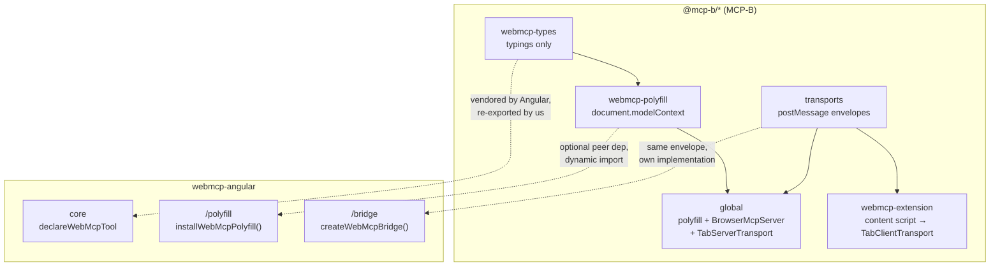
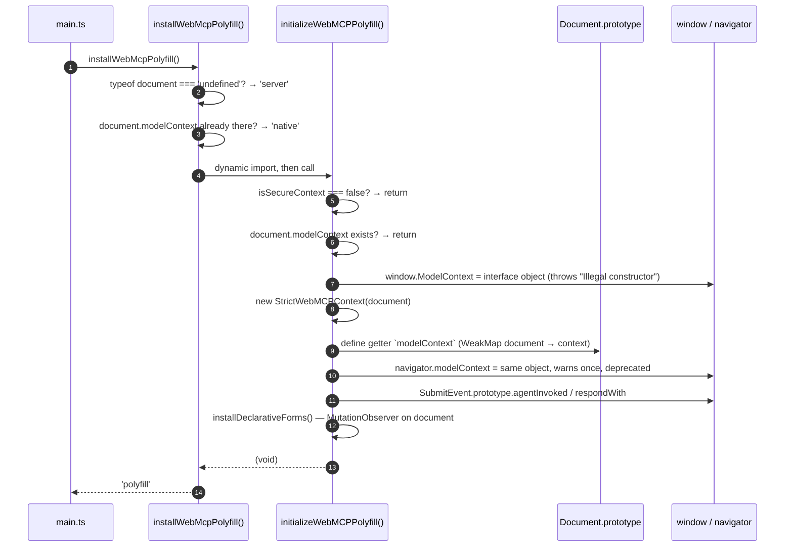
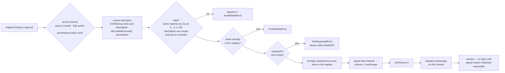
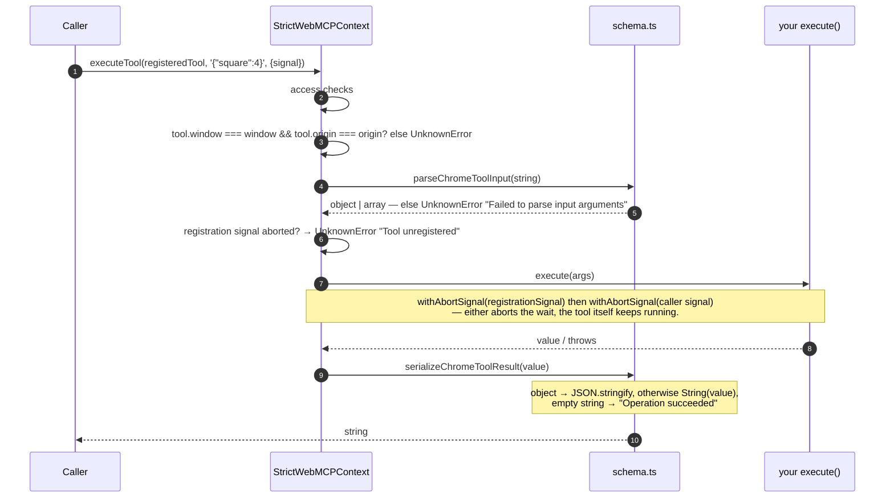

[← will this be standardised?](./09-will-this-be-standardised.md) · [contents](./README.md)

# 10. Inside the polyfill

`@mcp-b/webmcp-polyfill` is the `document.modelContext` you actually run against
today. This chapter is what it does, read from its source — so that when something
behaves a certain way, you know which of the three layers (draft, Chrome, polyfill)
decided it. The long version, one chapter per file, is
[`docs/polyfill/`](../polyfill/README.md).

**Source:** [`WebMCP-org/npm-packages`](https://github.com/WebMCP-org/npm-packages),
`packages/webmcp-polyfill`, cloned to `~/myGitHub/npm-packages` at commit `1c7a398`
(30 Aug 2026). Version **5.1.0**, the one this package pins. Three files:

| File | Lines | Owns |
|---|---|---|
| `src/index.ts` | 600 | the `ModelContext` class, install and cleanup |
| `src/schema.ts` | 477 | validation, argument parsing, result serialization, access checks |
| `src/declarative-forms.ts` | 938 | `<form toolname=…>` → tool, via `MutationObserver` |

70 unit tests, plus the upstream Web Platform Tests for the declarative half.

---

## Where it sits



This package uses **types** and the **polyfill** and nothing else from MCP-B. `global`
bundles the polyfill with a full MCP server and transport; our `/bridge` is the
same idea, written against `document.modelContext` directly so it works over
native Chrome too. The wire envelope is shared, so their extension can talk to our
bridge ([chapter 5](./05-transports.md#the-envelope)).

## What install does



Two things from steps 9–10 that shape everything downstream:

- **The getter lives on `Document.prototype`**, not on `document`, because WebIDL's
  `[SameObject] readonly attribute` says so and Chrome matches it. `'modelContext' in
  document` and `document.modelContext` work as expected; `Object.hasOwn(document,
  'modelContext')` is `false`.
- **Every property it installs is recorded**, and `cleanupWebMCPPolyfill()` restores
  each one in reverse. Measured: after cleanup `document.modelContext` is `undefined`
  and the prototype has no own `modelContext`. The property survives cleanup only when
  something *else* had already defined it — the polyfill skips a prototype that
  already has the key, so there is nothing recorded to remove.

## The object

`StrictWebMCPContext extends EventTarget`. Everything not in the draft's IDL is
`#private` or `static` on a module-private class, so the prototype exposes exactly
`registerTool`, `getTools`, `executeTool`, `ontoolchange` — and Chrome's
idlharness passes 20/20 against it.

```
   StrictWebMCPContext
   ├── #tools: Map<name, descriptor>          ← the registry
   ├── #ownerDocument                          ← for the access checks
   ├── #ontoolchangeHandler                    ← backs the `ontoolchange` attribute
   ├── #testingShim                            ← navigator.modelContextTesting, opt-in
   └── __isWebMCPPolyfill: true                ← non-enumerable marker; the one non-spec key
```

Each stored descriptor also carries three symbol-keyed fields: the **serialized
input schema** (stringified once at registration), the **registration signal**, and
the **abort listener** that removes the tool.

## `registerTool`



Step-by-step consequences for Angular code:

| Polyfill behaviour | What you see |
|---|---|
| Duplicate name → `InvalidStateError` rejection | the un-awaited loop in `provideWebMcpTools` turns it into an unhandled rejection ([chapter 6 §2](./06-what-bites-you.md)) |
| `exposedTo` → `NotSupportedError` | cross-document tools need native Chrome ([chapter 4](./04-scope-and-navigation.md#cross-origin-exposedto)) |
| `toolchange` after `setTimeout(0)` | a task, not a microtask — the promise resolves *after* the event, so a listener registered before `await registerTool()` returns sees it |
| Abort listener is `{once: true}` and removed on delete | aborting after unregistration is a no-op, and there is no leak |

## `getTools`

Returns a **fresh object per tool per call**, sorted by name, with:

```ts
{
  name,
  title: tool.title ?? '',                 // the '' default — hence `title || name`
  description,
  inputSchema: JSON.parse(storedString),   // object, per webmcp#241 — Chrome 154+ shape
  origin: globalThis.origin,
  window: globalThis.window,
  annotations?: {readOnlyHint, untrustedContentHint},
}
```

then `await setTimeout(0)`. The re-parse per call is deliberate: it mirrors Blink
parsing its own serialized copy, so a schema you mutate after registration does not
leak into later reads. A schema whose `toJSON` serializes to a non-object is omitted
rather than surfaced as a string. `fromOrigins` non-empty → `NotSupportedError`.

## `executeTool`



Three details that matter to us:

- **Arguments are a JSON string.** This is Chrome's extension shape, which the draft
  has since replaced with an object ([chapter 1](./01-what-webmcp-is.md#the-page-can-call-its-own-tools)).
  `parseChromeToolInput` is where the string becomes the object your tool receives.
- **`execute` is called with one argument.** The polyfill does not pass a `{signal}`
  client; the abort signals only race the *await*. The `client.signal` your Angular
  tool receives is built by our wrapper, and is why cancellation works at all
  ([chapter 2 ⑤](./02-the-lifecycle.md#the-real-implementation)).
- **A throwing tool becomes `DOMException('…invocation failed: <message>', 'UnknownError')`.**
  The bridge turns that into `isError: true` text so the model can read it
  ([chapter 5](./05-transports.md#one-mcp-convention-worth-copying)).

## `toolchange`

Dispatched on **the context object** (`this.dispatchEvent`), after `setTimeout(0)`,
on every register and every abort-driven removal. That matches the draft, which
fires the event at the document's `ModelContext`. `ontoolchange` is a real attribute
backed by `addEventListener`, so both spellings hear the same event. The testing
shim, when enabled, re-dispatches on itself.

## Access checks, in order

`validateWebMcpAccess` runs at the top of all three methods:

| Check | Fails with |
|---|---|
| `globalThis.originAgentCluster === false` (non-`file:`) | `SecurityError` |
| owner document not fully active (`defaultView.document !== ownerDocument`) | `InvalidStateError` |
| `document.permissionsPolicy` knows `'tools'` and disallows it | `NotAllowedError` |
| policy API absent **and** the document is a cross-origin frame | `NotAllowedError` — fails closed |

Plus, at install: `isSecureContext === false` → silently no install. And
`exposedTo` / `fromOrigins` entries must be potentially trustworthy (`https:`,
`wss:`, `file:`, extension schemes, localhost, `127.*`) or `SecurityError` — checked
even though non-empty arrays are then rejected as unsupported.

## Declarative forms

The other half of the draft, and the reason the file is the largest of the three:

```mermaid
sequenceDiagram
    autonumber
    participant DOM
    participant Obs as MutationObserver (per root)
    participant DF as declarative-forms.ts
    participant MC as modelContext
    participant Agent

    DOM->>Obs: <form toolname="search" tooldescription="…"> connected
    Obs->>DF: sync()
    DF->>DF: toolDefinition(form) — schema from named controls,<br/>fingerprint = JSON of it
    DF->>MC: registerTool({name, execute}, {signal: controller.signal})
    Note over DF,MC: One form per name — a second form with the same name<br/>is blocked until the first goes away.

    Agent->>MC: executeTool(search, '{"query":"shoes"}')
    MC->>DF: execute(input)
    DF->>DOM: fillForm() — set values, dispatch input/change
    alt toolautosubmit
        DF->>DOM: requestSubmit(submitter)
    else no autosubmit
        DF->>DOM: focus submitter, dispatch window 'toolactivated'
        Note over DOM: waits for the user to submit
    end
    DOM->>DF: submit (capture) — event.agentInvoked = true
    DF->>DF: page called event.respondWith(promise)? → resolve with it
    DF-->>MC: result

    DOM->>Obs: attribute / control changed
    Obs->>DF: sync() — fingerprint differs
    DF->>MC: controller.abort() → re-register
```



It observes the document **and every open shadow root** (patching `attachShadow` to
catch new ones), patches `HTMLFormElement.prototype.submit` to notice programmatic
submits, and cancels a pending execution when the form resets, changes, or
disconnects. Angular 22's `provideExperimentalWebMcpForms` targets this same
declarative surface; this package does not wrap it.

## Cleanup

`cleanupWebMCPPolyfill()`: stop the observers and restore the two patched prototypes;
abort every registration (which fires `toolchange` for each); restore every installed
property descriptor in reverse order; reset the deprecation-warning flag. Idempotent
install: a second `initializeWebMCPPolyfill()` sees `document.modelContext` and
returns. That is also why `installWebMcpPolyfill()` twice reports `'polyfill'` then
`'native'` — it cannot tell who installed the object, and does not try.

## What this package took from it

Every one of these is a polyfill behaviour our adapter or docs are built around:

| Behaviour | Where we absorb it |
|---|---|
| `title` defaults to `''` | `displayTitle()` — `tool.title \|\| tool.name` |
| `inputSchema` is an object here, a string on Chrome 149–153 | `normalizeInputSchema()` branches on `typeof` |
| `toolchange` fires at the context | bridge and devtools listen there (and on the document as a hedge) |
| `executeTool` takes a JSON string | bridge and devtools `JSON.stringify` at one call site |
| `execute` gets no `client` | our wrapper supplies `{signal: AbortSignal.any([...])}` |
| duplicate name rejects | documented as the unhandled-rejection symptom |
| cleanup restores the prototype | test teardown can rely on it for what the polyfill installed — see [`polyfill/01`](../polyfill/01-install-and-cleanup.md#cleanup) |
| `installTestingShim` off by default | `installWebMcpPolyfill({installTestingShim})` passes it through, default `false` |

## Reading it yourself

```bash
cd ~/myGitHub/npm-packages/packages/webmcp-polyfill
sed -n '/^class StrictWebMCPContext/,/^}/p' src/index.ts     # the object
grep -n "export function" src/schema.ts                        # the helpers
sed -n '/^export function installDeclarativeForms/,$p' src/declarative-forms.ts
```

The e2e conformance run (`conformance/polyfill-runtime.e2e.test.ts`) is the shortest
statement of what the polyfill promises: install, assert `__isWebMCPPolyfill`, run
the shared runtime and declarative suites, clean up.

---

[← back to contents](./README.md)
