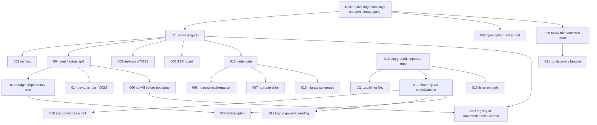

# Decisions

Why the package is shaped the way it is. One record per decision: the situation that
forced it, the options on the table, what was chosen, what it cost, and what would
reopen it. Read these when you are about to change something and want to know
whether the reason still holds.

The [architecture course](../architecture/README.md) explains *how* it works; the
[guide](../guide/README.md) explains *how to use it*; this folder is *why*. Things
not yet decided are sketched in [`ideas/`](../ideas/README.md).

## The one rule everything follows from

**Switching to Angular's native WebMCP must stay an open, cheap option.** Not a plan
to switch — several entry points have no Angular equivalent and staying is a
reasonable end state. The rule is that the *decision* must never be expensive: if an
app moves to Angular's API, nothing changes beyond imports.

Nearly every record below is that rule applied to one question.

## The decisions

| # | Decision | In one line |
|---|---|---|
| [001](./001-mirror-angular-not-invent.md) | Mirror Angular 22's API instead of designing our own | the first idea was a JSON-RPC registry; the constraint killed it |
| [002](./002-keep-native-migration-open.md) | Keep native migration an open option, not a goal | "exists to be deleted" was the wrong frame |
| [003](./003-naming.md) | `webmcp-angular`; no `ng-` prefix; no `Experimental` in our names | a package that mimics `@angular/core` must not look official |
| [004](./004-core-and-extras-split.md) | Core entry point is a byte-for-byte port; everything else is a separate entry point | so the core stays swappable whatever else you use |
| [005](./005-ssr-guard.md) | Guard SSR with `typeof document`, not `ngServerMode` | the only deliberate divergence in the core |
| [006](./006-polyfill-before-bootstrap.md) | The polyfill is installed in `main.ts`, before bootstrap, not by a provider | a provider would resolve after the tools had already failed to register |
| [007](./007-no-route-injector-shim.md) | Do not backport route-injector cleanup; document the component pattern | the riskiest code in the plan, replaced by a sentence |
| [008](./008-no-runtime-delegation.md) | Drop runtime detection of Angular's implementation | it bought nothing and broke the silence contract |
| [009](./009-one-provider-call-per-tool.md) | One `provideWebMcpTools` call per tool; `/strict` for authoring | replicate angular#70125, do not fix it locally |
| [010](./010-parity-gate.md) | One shared spec, run against ours and against `@angular/core`, weekly | the compatibility claim is tested, not asserted |
| [011](./011-tarball-not-file-install.md) | Test the built tarball, never a `file:` install | a symlink silently turned every tool argument into `any` |
| [012](./012-bridge-dependency-free.md) | `/bridge` implements the MCP-B envelope itself | keeps `@mcp-b/*` optional and the entry point small |
| [013](./013-listen-on-both-targets.md) | Listen for `toolchange` on the context and on the document | the polyfill was right, our listener was wrong, the hedge is free |
| [014](./014-devtools-as-plain-dom.md) | Devtools is plain DOM in a shadow root, behind a dynamic import | an inspector must not perturb what it inspects |
| [015](./015-migration-schematic.md) | Ship a `migrate` schematic, not `ng add` | the payoff of the whole premise has to be one command |
| [016](./016-playground-separate-repo.md) | The sample app is a separate repo consuming the built package | it exercises what ships, and it caught a packaging bug on day one |
| [017](./017-chat-only-through-modelcontext.md) | The playground chat may only reach the app through `document.modelContext` | otherwise the demo proves nothing |
| [018](./018-app-context-as-a-tool.md) | App-wide context is an ordinary tool, not a new API | three proposed APIs, all rejected for the same reason |
| [019](./019-tools-toggle-governs-sending.md) | The WebMCP toggle governs what the chat sends, not what the page registers | and it starts a new session |
| [020](./020-follow-the-contested-draft.md) | Follow the draft although WebKit opposes it | the cost is bounded either way |
| [021](./021-no-discovery-beacon.md) | Do not add a page-side discovery beacon | it helps only once agents agree to listen, and none do |
| [022](./022-bridge-opt-in.md) | The bridge is opt-in, off by default | the in-page agent never needs it; opening it is the operator's call |
| [023](./023-registry-at-document-modelcontext.md) | The registry stays at `document.modelContext`, even for an in-page-only app | Angular keeps no list; the address is the decision, the polyfill is replaceable |

## How they connect

Arrows read "made this one necessary" or "decided this one". Two roots: the rule,
and the choice to build a separate playground — most of the *measured* findings came
from the second.

## Record format

Each file has the same five parts, and nothing else:

1. **Situation** — what forced a choice, with the date.
2. **Options** — what was actually on the table, including the one taken.
3. **Decision** — one paragraph.
4. **What it cost** — the downside accepted, stated plainly.
5. **Revisit when** — the concrete signal that would reopen it.

Dates are absolute. Where a record cites a measurement or a source reading, the item
is in [`evidence.md`](./evidence.md) — every fact, with what it was checked against
and when.
