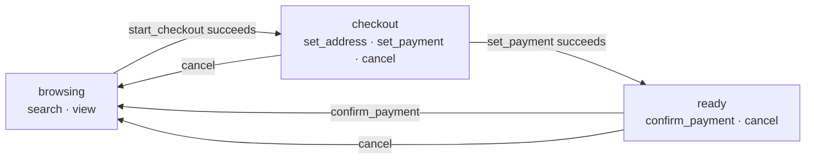

[← external MCP server](./01-external-mcp-server.md) · [ideas](./README.md)

# 02 · Workflows instead of a flat list

## The idea

Today a page publishes a flat list of tools. The idea is a tree: parent tasks with
child tasks, where the agent reaches the final step by way of intermediate ones, and
each intermediate result decides what comes next — a workflow rather than a single
call. *Start checkout → set the address → set the payment → confirm*, with `confirm`
not on offer until the steps before it have happened.

## What exists today

More than it looks.

**The loop is already a workflow engine.** The model picks the next tool from the
previous result — that is the rejected-then-retried arc in
[chapter 7, diagram 4](../architecture/07-lifecycle-in-page-agent.md#4-a-mutating-call-that-gets-rejected-then-retried),
and it is what "read before you write" in `about_this_app` produces. Every `execute`
result is an edge in a graph the model walks; a result that ends *"you can now call
set_address or cancel"* is a signpost the model follows.

**Scope is already conditional.** [Chapter 4](../architecture/04-scope-and-navigation.md#conditional-tools)
shows a tool that exists only while a dialog is open, because it is declared in the
dialog's injector. "This tool exists only now" is the one mechanism the draft has for
structure.

**What the draft does not have** is any grouping primitive. Names are flat; there is
no parent/child, no task object, no way to say "these three belong together" other
than naming and descriptions. MCP is the same. So any workflow structure is the
page's own, expressed through *what is registered when* and through text.

## Ways to build it

| | Prose only | Explicit workflow object handed to the model | State-scoped tools |
|---|---|---|---|
| How the model learns the path | descriptions and results say what comes next | a JSON graph in the system prompt or a `get_workflow` tool | it sees only the current state's tools; results name the next ones |
| Tools visible at once | all of them, always | all of them, always | the current node's children |
| Distractors / hazards | `confirm_payment` is callable from anywhere | same | not offered until reachable |
| Needs new API | no | a convention | no — injectors and `declareWebMcpTool` |
| Seen by all three agents | yes | only agents that read the graph | yes — it is just the live tool list |

## The way that fits

**State-scoped tools.** A workflow is a state machine whose current state decides
which tools are registered:



Each state is an injector. Entering it registers the children; leaving it aborts
them; `toolchange` fires; the next `getTools()` shows the new node. The transitioning
tool's result says what became available — *"Checkout started. You can now
set_address, set_payment, or cancel."* — so the model has a map without needing a
concept of hierarchy. It just sees the tools that make sense now, which is the whole
argument of chapter 4 applied on purpose.

This needs nothing new in the draft, is visible to all three agents, and works the
same after a native migration because it only ever calls `declareWebMcpTool` with the
right injector. A small helper would make it declarative:

```ts
// no @angular/core equivalent — a separate entry point, e.g. webmcp-angular/workflow
const checkout = defineWorkflow({
  initial: 'browsing',
  states: {
    browsing: [searchTool, viewTool, startCheckoutTool],
    checkout: [setAddressTool, setPaymentTool, cancelTool],
    ready:    [confirmPaymentTool, cancelTool],
  },
});
checkout.go('checkout');     // aborts browsing's tools, registers checkout's
checkout.state();            // a signal, for the UI to mirror the same state
```

with the helper appending *"Now available: …"* to each transitioning result, so the
signpost is never forgotten.

## What it would cost

- **The model may not follow the path.** It can remember `confirm_payment` from an
  earlier turn and try it from `browsing`. Two defences already exist: the harness
  reads the live list each turn, so the name is not in `tools`; and if it arrives
  anyway, *"No tool named confirm_payment is currently registered"* is a result it can
  read. A workflow that depends on the model never trying is wrong; one that makes
  trying harmless is right.
- **Two sources of truth.** The workflow's state and the app's own state (the cart,
  the router) must agree. The helper should *follow* app state, not own it — a
  `computed` from the store deciding the state, never the other way round — or the
  tools and the screen drift apart.
- **`toolchange` churn.** Every transition is an abort plus a batch of registrations.
  Cheap in the page; for a connected external client it is a `list_changed` and a
  refetch per step.
- **Descriptions still matter more than structure.** A model that sees three tools
  with vague descriptions will still pick wrongly; the tree narrows choices, it does
  not make them.
- **Parallel calls.** A model may call `set_address` and `set_payment` in one turn;
  transitions that depend on order need the results to say so.

## Open questions

- Should a state's tools be a *set* or a *stack* — does entering `checkout` hide
  `search`, or keep it available underneath?
- Is `about_this_app` the right place for the whole map ("this app has a checkout
  flow with three steps"), or should each result carry only the next edge?
- Could the same helper drive [idea 01](./01-external-mcp-server.md)'s lazy
  mirroring — a `crm.list_tools` state whose children are the real remote tools?
- Does the draft's `annotations` (`readOnlyHint`, `consequentialHint`) belong on
  transitions, so a browser agent can ask before a consequential step?

---

[← ideas](./README.md)
