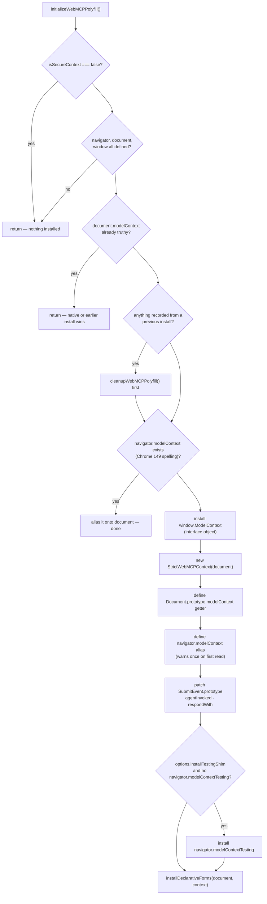
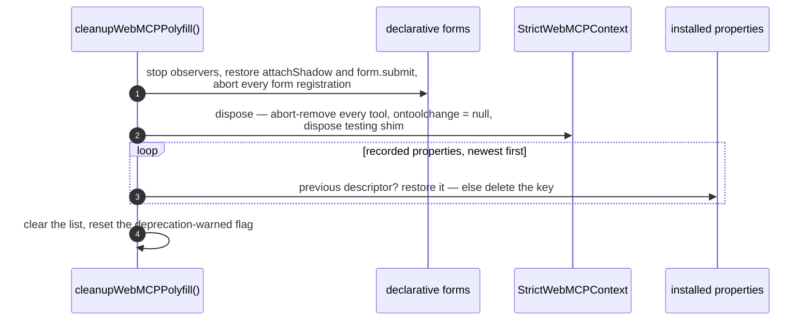

[← contents](./README.md) · next: [The registry →](./02-the-registry.md)

# 1. Install and cleanup

`initializeWebMCPPolyfill(options?)` and `cleanupWebMCPPolyfill()` — `src/index.ts`,
the last 120 lines.

## What install does, in order



Every `installProperty()` call pushes `{target, key, previous}` onto a module-level
list. That list is the whole cleanup story.

## Where the getter lives, and why

```ts
// WebIDL: [SameObject] readonly attribute ModelContext modelContext;  — on Document
const documentModelContexts = new WeakMap<Document, ModelContext>();

Object.defineProperty(Document.prototype, 'modelContext', {
  configurable: true, enumerable: true,
  get() {
    if (!(this instanceof Document)) throw new TypeError('Illegal invocation');
    return documentModelContexts.get(this);
  },
});
```

| Consequence | Result |
|---|---|
| `'modelContext' in document` | `true` |
| `document.modelContext` | the context |
| `Object.hasOwn(document, 'modelContext')` | `false` — it is on the prototype |
| `Document.prototype.modelContext` (read directly) | throws `Illegal invocation`, like Chrome |
| `delete document.modelContext` | no effect |
| `document.modelContext === document.modelContext` | `true` — `[SameObject]` via the WeakMap |

The getter's `name` is pinned to `"get modelContext"` because Chrome reports that and
minifiers would rename it. The same care goes into `window.ModelContext`: a function
*expression* (so `IsConstructor` passes), `name` pinned, `prototype` set to the class
prototype, `[[Prototype]]` set to `EventTarget` — because `interface ModelContext :
EventTarget` requires `Object.getPrototypeOf(ModelContext) === EventTarget`. Calling
it throws `Illegal constructor`. This is what makes Chrome's idlharness test pass
20/20 against the polyfill.

## The deprecated alias

`navigator.modelContext` is defined as a getter returning the same object, with a
one-time `console.warn` pointing at [webmcp#184](https://github.com/webmachinelearning/webmcp/pull/184)
(the May 2026 draft that moved the attribute from `Navigator` to `Document`). If the
browser already has a *native* `navigator.modelContext` and no `document.modelContext`
— Chrome 149 — the polyfill installs nothing of its own and just aliases the native
object onto `document`.

## Cleanup



**Measured** against the shipped 5.1.0 in a clean jsdom:

```
after install : typeof document.modelContext = object    | own on Document.prototype: true
after cleanup : typeof document.modelContext = undefined | own on Document.prototype: false
re-install    : typeof document.modelContext = object
```

What cleanup **cannot** touch is a `modelContext` that existed before install — step
`D` in the first diagram returns early and records nothing. In a shared test realm
that is usually a harness's own property on `document`, or an earlier spec's. That is
the situation behind the teardown in [`STATUS.md`](../STATUS.md#things-that-cost-real-time-worth-not-rediscovering)
and the teardown in `parity/specs/polyfill.spec.ts`.

## How `webmcp-angular/polyfill` wraps it

```ts
export async function installWebMcpPolyfill(options = {}): Promise<WebMcpBacking> {
  if (typeof document === 'undefined') return 'server';          // SSR: nothing to install onto
  if (resolveModelContext().modelContext) return 'native';       // never replace a real one
  try {
    const {initializeWebMCPPolyfill} = await import('@mcp-b/webmcp-polyfill');
    initializeWebMCPPolyfill({installTestingShim: options.installTestingShim ?? false});
  } catch { return 'unavailable'; }                              // optional peer dep absent
  return resolveModelContext().modelContext ? 'polyfill' : 'unavailable';
}
```

Two of the polyfill's own checks are repeated on our side on purpose: the SSR guard
(so the dynamic import never runs on a server) and the "already there" check (so the
return value can say `'native'`). The polyfill's `isSecureContext` check is not
repeated — on `http://` other than localhost the polyfill silently declines and we
report `'unavailable'`, which is the truthful answer.

---

next: [The registry →](./02-the-registry.md)
