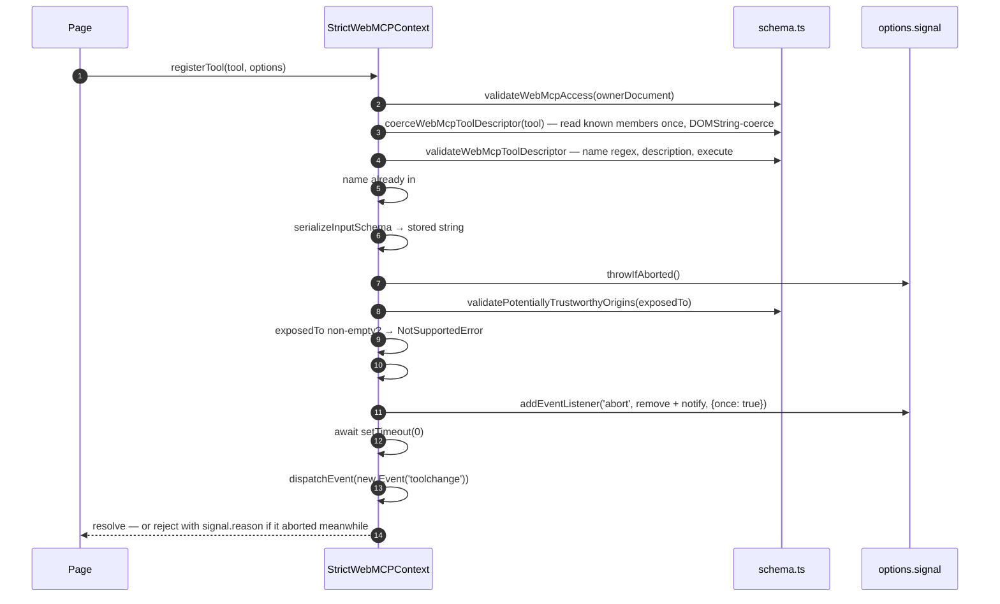

[← install and cleanup](./01-install-and-cleanup.md) · [contents](./README.md) · next: [executeTool →](./03-execute-tool.md)

# 2. The registry

`class StrictWebMCPContext extends EventTarget implements ModelContext` — `src/index.ts`.

## Shape

```
StrictWebMCPContext
├── #tools: Map<string, PolyfillToolDescriptor>   the registry, keyed by name
├── #ownerDocument: Document | null               for the access checks
├── #domException                                 the owner window's DOMException class
├── #ontoolchangeHandler                          backs the `ontoolchange` attribute
├── #testingShim: PolyfillTestingShim | null      navigator.modelContextTesting, opt-in
└── __isWebMCPPolyfill = true                     non-enumerable marker — the one non-spec key

PolyfillToolDescriptor  (what the Map holds)
├── name · title? · description · inputSchema? · annotations?
├── execute(input)                                 wrapped: Reflect.apply(original, undefined, [input])
├── [REGISTERED_INPUT_SCHEMA]: string              stringified once, at registration
├── [REGISTRATION_SIGNAL]: AbortSignal?            the signal you passed
└── [REGISTRATION_ABORT]: () => void               the listener that removes the tool
```

Why `#private` and not TypeScript `private`: TypeScript's modifier is erased and
leaves ordinary enumerable own properties, which leak through `Object.keys`, spread,
and make `JSON.stringify` throw on the `ownerDocument` cycle. Chrome's instance has no
own keys, so neither does this one. The four IDL members are then re-defined as
`enumerable: true` on the prototype, because WebIDL members are enumerable and class
methods are not.

## `registerTool(tool, {signal?, exposedTo?})`



Rules that fall out of it:

| Rule | Where |
|---|---|
| Names are unique per document, and the check is `Map.has` | step 5 |
| The schema is serialized **once**; later mutation of your object is invisible | step 6 |
| A pre-aborted signal rejects before anything is stored | step 7 |
| `exposedTo: []` is fine; `exposedTo: ['https://x']` is `NotSupportedError` — cross-document needs native | step 9 |
| The promise resolves **after** the `toolchange` task, so a listener attached before the `await` hears it | steps 12–14 |
| Abort after the tool was already removed (re-registered under the same name) is a no-op — the remove checks identity | `#removeTool(name, expected)` |

The abort listener is `{once: true}` and is explicitly removed on delete, so a
long-lived signal used for many registrations does not accumulate listeners.

## `getTools({fromOrigins?})`

```ts
[...#tools.values()]
  .map(tool => ({
    name: tool.name,
    title: tool.title ?? '',                          // spec default: '' — read it as `title || name`
    description: tool.description,
    ...(parsed is a plain object ? {inputSchema: JSON.parse(stored)} : {}),
    origin: globalThis.origin,
    window: globalThis.window,
    ...(tool.annotations ? {annotations: {readOnlyHint, untrustedContentHint}} : {}),
  }))
  .sort(byName);
await setTimeout(0);
```

- **A fresh object per call.** The stored *string* is parsed every time, mirroring
  Blink parsing its own serialized copy ([webmcp#241](https://github.com/webmachinelearning/webmcp/pull/241)).
  Nothing you do to a returned object reaches the registry.
- **`inputSchema` is an object** — the post-#241 shape, rolling out in Chrome from
  154.0.8013. The origin-trial builds still return a string for same-document tools. A schema whose `toJSON` serializes to a non-object is *omitted* rather than
  surfaced as a string a consumer would mistake for the old shape.
- **`annotations` is omitted** when none were registered — both the draft and the
  polyfill do that, so guard the member, not the hints inside it.
- `fromOrigins` non-empty → `NotSupportedError`, same reason as `exposedTo`.

## `toolchange` and `ontoolchange`

```ts
async #notifyToolsChanged() {
  await new Promise(resolve => setTimeout(resolve, 0));   // a task, not a microtask
  this.dispatchEvent(new Event('toolchange'));            // ← on the context object
  this.#testingShim?.dispatchToolChange();
}
```

The draft fires `toolchange` at the document's `ModelContext` on the *webmcp task
source*; the platform does not expose that source, so a zero-delay timer stands in.
The event never reaches `document` — listen on `document.modelContext`.

`ontoolchange` is a real event-handler attribute: setting it adds one internal
listener the first time, replacing the handler keeps that listener's position in the
dispatch order, and setting `null` removes it. Two unit tests pin exactly that.

## The testing shim

`installTestingShim: true` (off by default, and off in `installWebMcpPolyfill()`)
installs `navigator.modelContextTesting`, a removed Chromium preview surface some
tooling still probes:

| Member | Backed by |
|---|---|
| `listTools()` | the registry, with `inputSchema` as the **string** (pre-#241 shape, deliberately) |
| `executeTool(name, json, options?)` | the same `#invokeToolByName` as the real one, by name instead of by `RegisteredTool` |
| `ontoolchange` / `toolchange` | re-dispatched from the context's notify |

It is opt-in so the default install stays spec-pure. `@mcp-b/global` turns it on;
we do not.

---

next: [executeTool →](./03-execute-tool.md)
