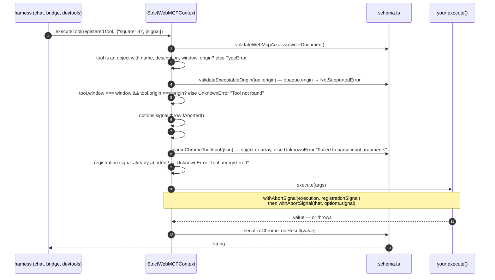

[← the registry](./02-the-registry.md) · [contents](./README.md) · next: [Validation and access →](./04-validation-and-access.md)

# 3. `executeTool`

`executeTool(tool: RegisteredTool, inputArgsJson: string, options?: {signal?})` —
Chrome's extension shape, which the polyfill implements as-is. The draft has since
adopted `executeTool` into the interface with an argument **object**; nothing
runnable today has that shape ([architecture chapter 1](../architecture/01-what-webmcp-is.md#the-page-can-call-its-own-tools)).

## The call



## The `RegisteredTool` you pass in must be one you got out

Steps 3–5 are why you cannot hand-build a `RegisteredTool`: it must carry `window`
and `origin`, and both must match the current document. This is the polyfill's
stand-in for Chrome's cross-document routing — with only one document to route to, a
mismatch is simply "not found". The bridge and devtools therefore always do
`(await getTools()).find(t => t.name === name)` first and pass that object through.

## Arguments: string in, object out

```ts
export function parseChromeToolInput(input: string): WebMcpToolInput {
  try {
    const value = JSON.parse(input);
    if (Array.isArray(value) || isPlainObject(value)) return value;
  } catch {}
  throw createUnknownError('Failed to parse input arguments');
}
```

The name says it: this is Chrome's shape. A top-level array is accepted (one unit
test pins it), a primitive is not. This is the only place the string becomes the
object your tool receives, and it is why the bridge and devtools `JSON.stringify` at
their single call site — when an implementation switches to the draft's object
shape, that line is the change.

## `execute` gets one argument

```ts
execute: (input) => Reflect.apply(coerced.execute, undefined, [input]),
```

No `{signal}` client. The unit test is literally *"invokes the standard execute
callback with only the input argument"*. The abort signals below race the **await**,
not the tool: an aborted call rejects the caller's promise while your function keeps
running to completion. The `client.signal` an Angular tool receives is built by our
wrapper — `AbortSignal.any([injectorTeardown, client?.signal])` — and `client?.signal`
is `undefined` under the polyfill, so under the polyfill it is the injector's teardown
alone ([architecture chapter 2 ⑤](../architecture/02-the-lifecycle.md#the-real-implementation)).

## Abort composition

```ts
const execution = withAbortSignal(Promise.resolve(tool.execute(args)),
                                  registrationSignal, () => UnknownError('Tool unregistered'));
rawResult = await withAbortSignal(execution, options?.signal);
```

`withAbortSignal` wraps a promise so that an abort rejects it early and removes its
own listener either way. Two layers: the registration signal (tool went away
mid-call → `UnknownError('Tool unregistered')`) and the caller's signal (→ rejects
with `signal.reason`, preserved as-is).

## Error mapping

| The tool… | The caller sees |
|---|---|
| returns a string | that string |
| returns an object / array | `JSON.stringify(value)` |
| returns something `JSON.stringify` cannot handle | `String(value)` |
| returns `''` / `undefined` / `null` | `'Operation succeeded'` |
| throws `Error(msg)` | `DOMException('Tool was executed but the invocation failed. For example, the script function threw an error: msg', 'UnknownError')` |
| is aborted by the caller's signal | rejection with `signal.reason`, untouched |
| is unregistered mid-call | `DOMException('Tool unregistered', 'UnknownError')` |

The bridge catches the `UnknownError` and returns MCP `{content: [{type: 'text',
text}], isError: true}` so the model reads the failure instead of the turn ending
([architecture chapter 5](../architecture/05-transports.md#one-mcp-convention-worth-copying)).
Throwing from a tool is still the worse path: the message is wrapped in that long
prefix and carries no structure. Return the failure as text.

---

next: [Validation and access →](./04-validation-and-access.md)
