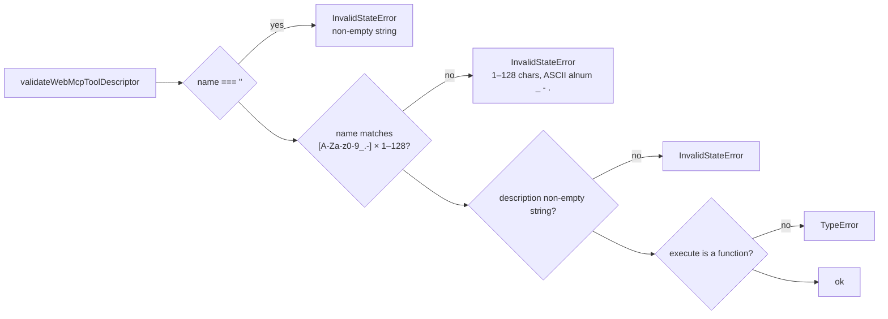
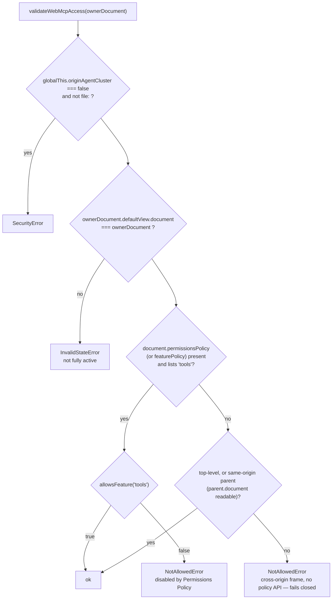

[← executeTool](./03-execute-tool.md) · [contents](./README.md) · next: [Declarative forms →](./05-declarative-forms.md)

# 4. Validation and access

`src/schema.ts` — 477 lines, no DOM class of its own, also published as
`@mcp-b/webmcp-polyfill/schema` for other MCP-B packages to share.

## Descriptor coercion — what `registerTool` reads from your object

`coerceWebMcpToolDescriptor` reads each known member **once** via `Reflect.get` and
builds a new object, as a WebIDL dictionary conversion would. Your object is not
retained.

| Member | Coercion |
|---|---|
| `name`, `description` | required (`TypeError` if `undefined`); `String(value)`; a `symbol` throws `TypeError` |
| `title` | optional; `String(value).toWellFormed()` — lone surrogates repaired, since it may reach native UI |
| `inputSchema`, `outputSchema` | passed through untouched here; serialized later |
| `execute` | passed through; checked to be a function in the next step |
| `annotations` | `readOnlyHint` and `untrustedContentHint` always emitted as booleans; `title`, `destructiveHint`, `idempotentHint`, `openWorldHint` only if present |

## Descriptor validation



The name regex is the draft's; a unit test pins that exactly 128 characters pass.

## Schema serialization

```ts
serializeInputSchema(schema)   // JSON.stringify — TypeError if not an object or not serializable
```

Stored as the string; re-parsed on every `getTools()`. Errors from a custom `toJSON`
are rethrown; a `toJSON` returning `undefined` rejects; one that serializes to a
non-object makes the member disappear from `getTools()`. The polyfill does **not**
validate JSON Schema keywords — *"serializes inputSchema without semantically
validating JSON Schema keywords"* is a test name — and it never validates arguments
against the schema at call time ([architecture chapter 1](../architecture/01-what-webmcp-is.md#validation-is-yours)).

`normalizeInputSchema` (the `/schema` entry, used by `@mcp-b/global`, not by the
strict registration path) additionally accepts Standard Schema v1 objects that expose
`~standard.jsonSchema.input()`, converts them to JSON Schema, defaults `{}` to
`{type: 'object', properties: {}}`, and adds `type: 'object'` when missing. That is
an MCP-B convenience; the boundary the draft describes takes plain JSON Schema.

## Access checks — `validateWebMcpAccess`, on every method



Two of these show up in practice:

- **Detached document** — a tool registered from an `<iframe>` that was then removed
  rejects with `InvalidStateError` on the next call. Test: *"rejects registration,
  discovery, and execution from a detached document"*.
- **Cross-origin iframe on a browser without the `tools` policy feature** — fails
  closed. On Chrome, which has the feature, `allow="tools"` on the frame is the fix
  ([architecture chapter 4](../architecture/04-scope-and-navigation.md#cross-origin-exposedto)).

## Origin checks

| Function | Used for | Accepts |
|---|---|---|
| `validatePotentiallyTrustworthyOrigins(list)` | `exposedTo`, `fromOrigins` | parses each with `new URL`; `https:`, `wss:`, `file:`, `chrome-extension:`, `moz-extension:`; or `localhost`, `*.localhost`, `127.*`, `::1` — else `SecurityError` |
| `validateExecutableOrigin(origin)` | `executeTool`'s `RegisteredTool.origin` | any non-opaque origin — `'null'` → `NotSupportedError` |
| `validateOriginAgentCluster()` | every call | `originAgentCluster === false` is a hard `SecurityError` outside `file:` |

The trustworthy-origin check runs even though a non-empty list is then rejected as
unsupported — the polyfill reports the *right* error for bad input before reporting
that it cannot honour good input.

## Argument and result codecs

Covered in [chapter 3](./03-execute-tool.md): `parseChromeToolInput` (JSON string →
object or array), `serializeChromeToolResult` (anything → string, `'Operation
succeeded'` for empty), `withAbortSignal` (race a promise against a signal, clean up
either way), and the three `DOMException` factories — `UnknownError`,
`InvalidStateError`, and the *"Tool was executed but the invocation failed…"* wrapper.

---

next: [Declarative forms →](./05-declarative-forms.md)
