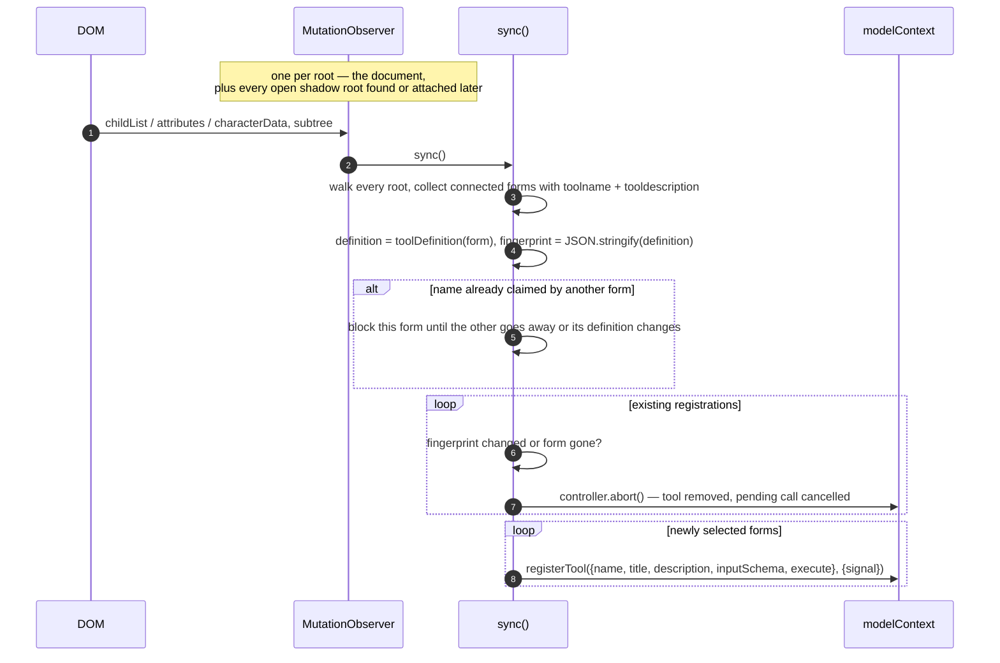
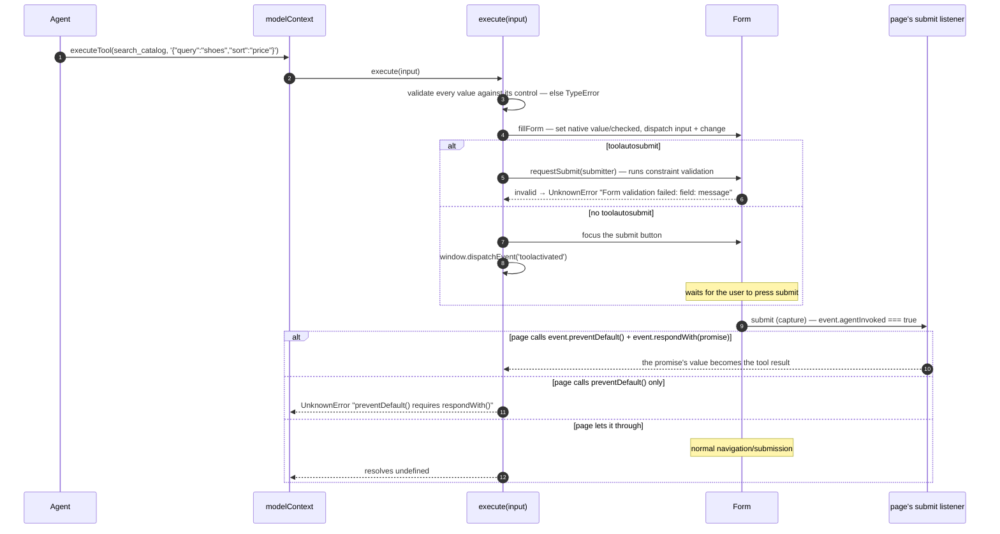

[← validation and access](./04-validation-and-access.md) · [contents](./README.md) · next: [What it means for webmcp-angular →](./06-for-webmcp-angular.md)

# 5. Declarative forms

`src/declarative-forms.ts` — the largest file, implementing the draft's second
registration path: an annotated `<form>` *is* a tool. Angular 22 targets this surface
with `provideExperimentalWebMcpForms`; `webmcp-angular` does not wrap it, but the
polyfill installs it whenever it owns `document.modelContext`, so it is running under
every playground page.

## Markup → tool

```html
<form toolname="search_catalog" tooldescription="Search the product catalog" toolautosubmit>
  <label>Words to match <input name="query" required /></label>
  <select name="sort"><option>relevance</option><option>price</option></select>
  <button type="submit">Search</button>
</form>
```

becomes

```json
{
  "name": "search_catalog",
  "title": "",
  "description": "Search the product catalog",
  "inputSchema": {
    "type": "object",
    "properties": {
      "query": {"type": "string", "description": "Words to match"},
      "sort":  {"type": "string", "enum": ["relevance", "price"]}
    },
    "required": ["query"]
  }
}
```

### Schema synthesis, per named control group

| Control | Schema |
|---|---|
| `text`, `email`, `password`, `search`, `tel`, `url`, `<textarea>` | `string`, plus `pattern` if valid |
| `number` | `number` with `minimum` / `maximum` / `multipleOf` from `min` / `max` / `step` |
| `range` | as `number`, defaulting to 0–100 |
| `checkbox` (one) | `boolean` |
| `checkbox` (group, same `name`) | `array` of `string` enum, `uniqueItems` |
| `radio` (group) | `string` enum |
| `<select>` / `<select multiple>` | `string` enum / `array` of it |
| `date`, `month`, `week`, `time`, `datetime-local`, `color` | `string` with a `format` regex |
| `hidden` | only if it carries `toolparamdescription` |
| disabled, read-only, `file`, `submit`, `button` | skipped |

Description comes from `toolparamdescription`, else the `<label>` text (with nested
controls stripped), else `aria-description`; a group takes it from a common
`<fieldset>`. `required` on any control in the group marks the parameter required.

## Keeping the registry in sync with the DOM



Two prototype patches make this complete: `Element.prototype.attachShadow` is wrapped
so a *new* open shadow root gets an observer the moment it exists, and
`HTMLFormElement.prototype.submit` is wrapped so a programmatic `form.submit()`
(which fires no `submit` event) still settles a pending call. Both are restored on
cleanup. Closed shadow roots cannot be inspected.

## A call: fill, submit, respond



Values are set through the **native** `value` / `checked` setters, then `input` and
`change` are dispatched — so a framework listening for those (Angular's forms, React's
synthetic events) sees the change as if typed. Validation is against what the control
would accept (a probe `<input>` of the same type), not against the synthesized schema.

A pending call is cancelled — with `UnknownError` — if the form is reset, its
definition changes, it leaves the DOM, or the polyfill is cleaned up. Only one call per
form is pending at a time; a second cancels the first.

## `SubmitEvent.agentInvoked` and `respondWith`

Installed on `SubmitEvent.prototype` at init. `agentInvoked` is `true` only for a
trusted submit on a form with a running tool call — ordinary user submissions are
never attributed to the agent (a 5.0 fix). `respondWith(promise)` throws
`InvalidStateError` unless the event is agent-invoked, `preventDefault()` was called,
and dispatch is still in progress.

## What is not emulated

From the package README: native CSS tool-state pseudo-classes, `toolcancel`,
responses that survive a navigation, file inputs, custom form-associated elements,
closed shadow roots. Chrome's declarative implementation is ahead of the draft's text
here; the polyfill tracks the upstream Web Platform Tests instead.

---

next: [What it means for webmcp-angular →](./06-for-webmcp-angular.md)
