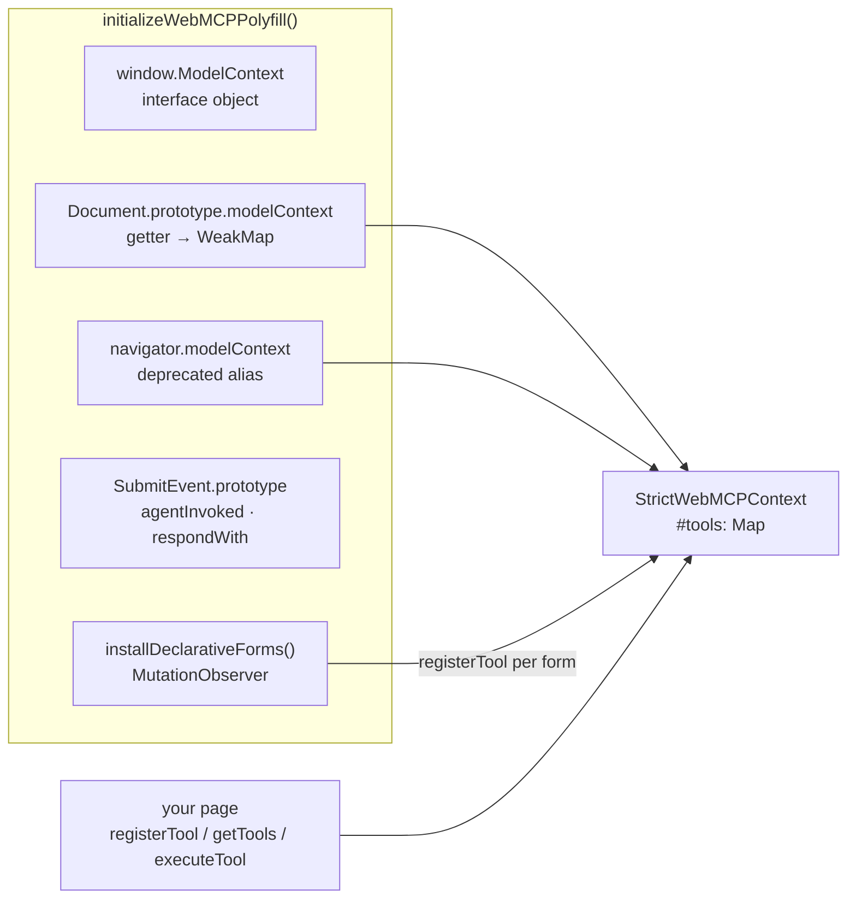

# `@mcp-b/webmcp-polyfill`, from the source

The `document.modelContext` this package runs against in every browser that has no
native WebMCP — which today is all of them outside a flagged Chrome. This folder is
its architecture, read from the source, so that when something behaves a certain way
you can tell which layer decided it: the W3C draft, Chrome, or the polyfill.

[Architecture chapter 10](../architecture/10-inside-the-polyfill.md) is the one-page
version. This folder is the long one.

## Source

| | |
|---|---|
| Repository | [`WebMCP-org/npm-packages`](https://github.com/WebMCP-org/npm-packages), `packages/webmcp-polyfill` |
| Local clone | `~/myGitHub/npm-packages` — commit `1c7a398`, 30 Aug 2026 |
| Version | **5.1.0**, the one `webmcp-angular` pins as an optional peer dependency |
| Licence | MIT |
| Runtime deps | `@mcp-b/webmcp-types` (types only), `@standard-schema/spec` (types only) |

```
packages/webmcp-polyfill/
├── src/index.ts               600   ModelContext class · install · cleanup
├── src/schema.ts              477   coercion · validation · argument/result codecs · access checks
├── src/declarative-forms.ts   938   <form toolname> → tool, MutationObserver-driven
├── src/iife.ts                 15   <script> build: auto-initialises on load
├── src/index.test.ts         1554   70 unit tests, run in real Chromium via Playwright
└── conformance/                31   shared runtime + declarative suites (upstream WPT)
```

Three build outputs: `dist/index.js` (ESM, no side effects — you call
`initializeWebMCPPolyfill()`), `dist/schema.js` (the helpers, importable alone), and
`dist/index.iife.js` (minified, global `WebMCPPolyfill`, installs on load).

## Read in this order

| # | Chapter | What you get |
|---|---|---|
| 1 | [Install and cleanup](./01-install-and-cleanup.md) | What `initializeWebMCPPolyfill()` puts where, why the getter is on `Document.prototype`, and what cleanup restores |
| 2 | [The registry](./02-the-registry.md) | `registerTool`, `getTools`, `toolchange` — the `Map` and the rules around it |
| 3 | [`executeTool`](./03-execute-tool.md) | Identity checks, the JSON-string argument, abort composition, error mapping |
| 4 | [Validation and access](./04-validation-and-access.md) | Everything in `schema.ts`: coercion, name rules, schema serialization, the four access checks |
| 5 | [Declarative forms](./05-declarative-forms.md) | How an annotated `<form>` becomes a tool, and what happens when an agent calls it |
| 6 | [What it means for webmcp-angular](./06-for-webmcp-angular.md) | Every polyfill behaviour this package is built around, and where each one lives in our code |

## The one-diagram version



One object, reachable two ways, fed from two directions: your code registering
imperatively, and the forms observer registering on the DOM's behalf.

## Verified how

Every claim in this folder was read from the files above at that commit. Where it
says *measured*, a probe was run against the shipped `dist` in jsdom or Chrome and the
result is quoted. The 70 unit-test names are listed in chapter 6 as the shortest
statement of what the package promises.
